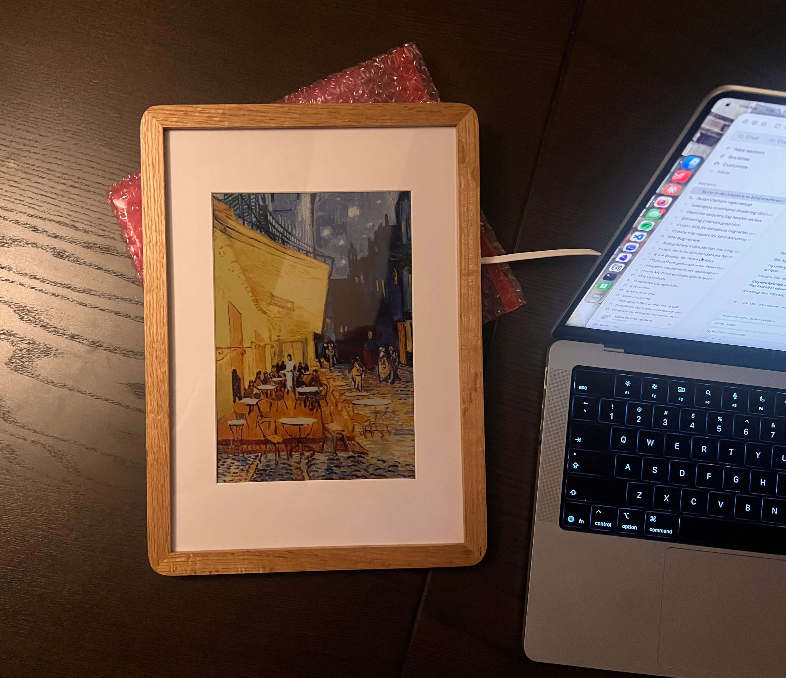
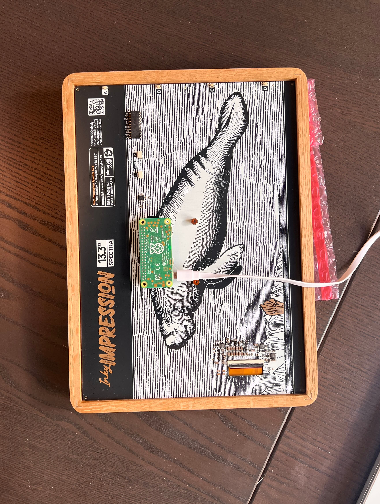
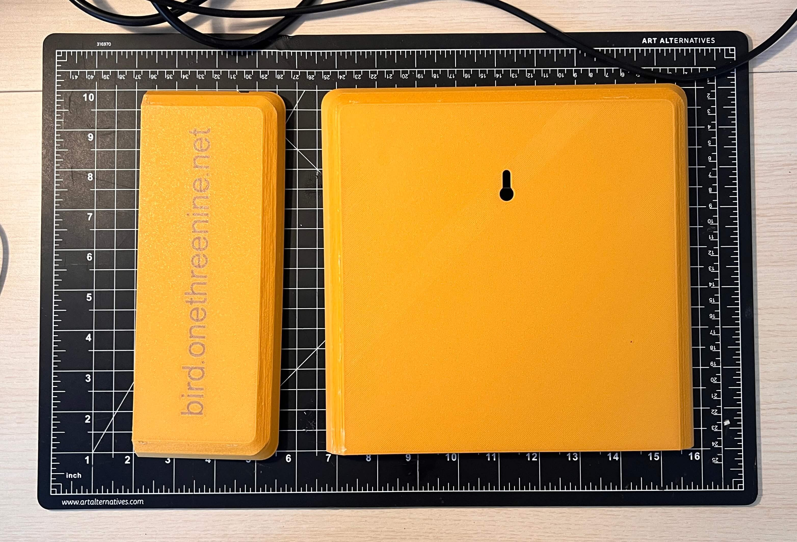
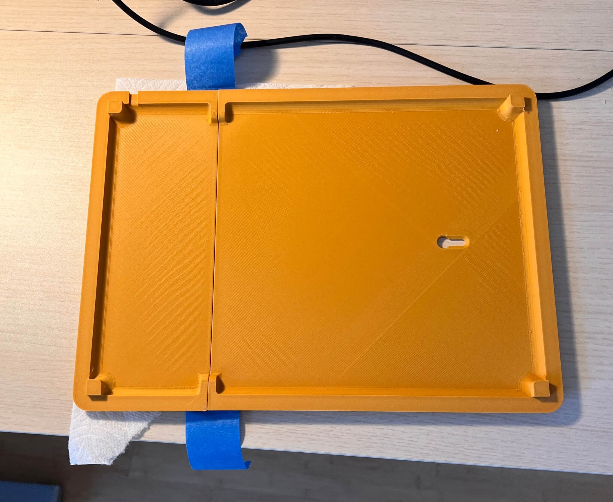
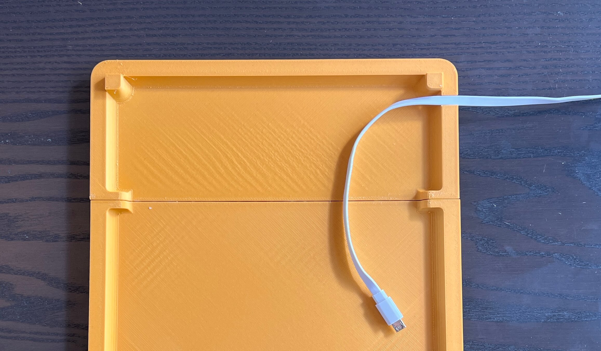
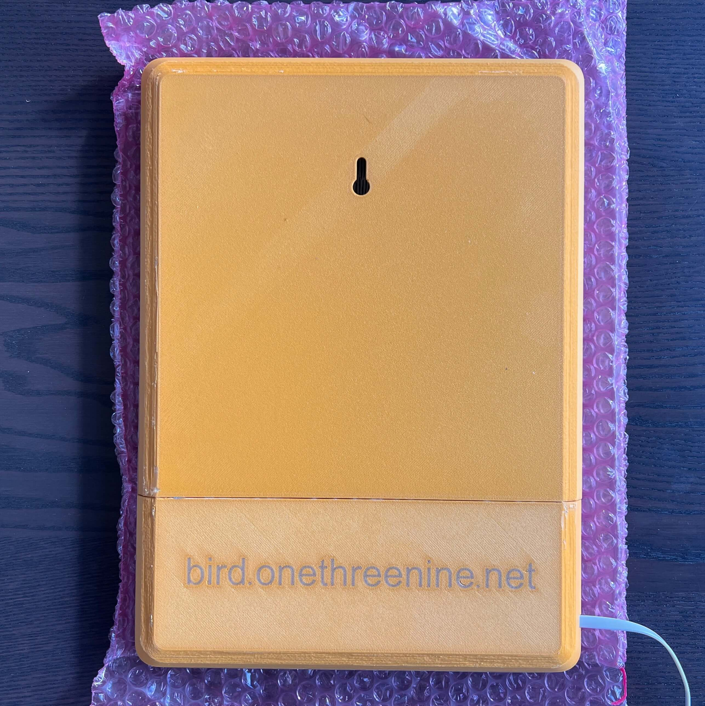
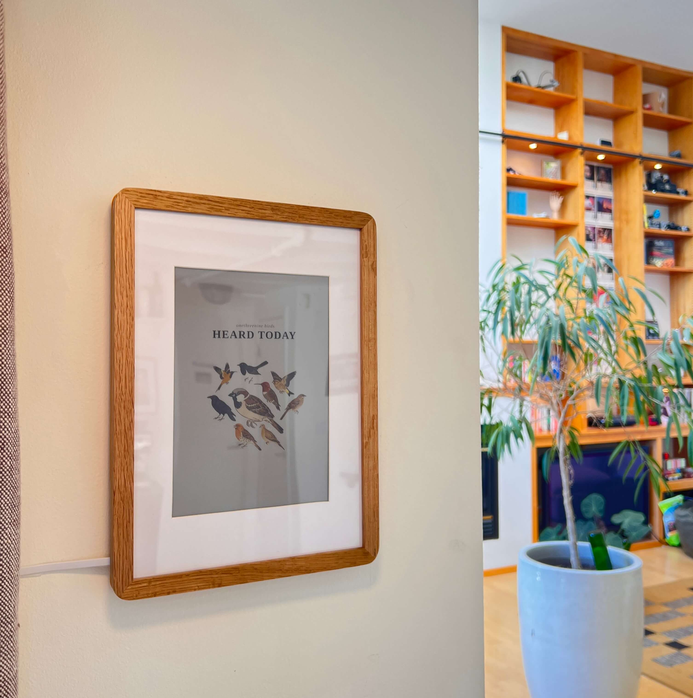

{.newthought}I was initally planning{/.newthought} on leaving this as a 'true' personal project of sorts. I love a good [project writeup](https://theodore.net/projects/) of course, but frankly I thought this was too quick an afternoon project to warrant any more documentation than a tweet. Twitter thought otherwise ...

<center>
  <br>
  <div class="tweet-container">
    <div class="tweet-item single">
      <span class="lighttweet"><blockquote class="twitter-tweet"><p lang="en" dir="ltr">i mounted a tiny microphone on my apartment balcony to listen for any birds passing by and built a site to collage them as they&#39;re heard <a href="https://t.co/85KrLRL5tu">pic.twitter.com/85KrLRL5tu</a></p>&mdash; Teddy (@WarnerTeddy) <a href="https://x.com/WarnerTeddy/status/2060018688645115964?ref_src=twsrc%5Etfw">May 28, 2026</a></blockquote> <script async src="https://platform.x.com/widgets.js" charset="utf-8"></script> </span>
      <span class="darktweet"><blockquote class="twitter-tweet" data-theme="dark"><p lang="en" dir="ltr">i mounted a tiny microphone on my apartment balcony to listen for any birds passing by and built a site to collage them as they&#39;re heard <a href="https://t.co/85KrLRL5tu">pic.twitter.com/85KrLRL5tu</a></p>&mdash; Teddy (@WarnerTeddy) <a href="https://x.com/WarnerTeddy/status/2060018688645115964?ref_src=twsrc%5Etfw">May 28, 2026</a></blockquote> <script async src="https://platform.x.com/widgets.js" charset="utf-8"></script> </span>
    </div>
  </div>
  <br>
</center>

... so I've thrown together this short writeup for any of you who want to monitor any avian visitors that may be passing by your own place. It's short and sweet for now in an attempt to get something out quickly, but this work is part of a longer chain of bird-tangent projects i'll write something up about soon!

---

### Apartment Birds

Avian Visitors is a fork of [BirdNET-Pi](https://github.com/Nachtzuster/BirdNET-Pi) with a kachō-e collage overlay on top of it. BirdNET-Pi handles the audio capture and the species identification, running Cornell's [BirdNET](https://birdnet.cornell.edu/) acoustic classifier against whatever a USB mic on the Pi picks up. 

See it running at [bird.onethreenine.net](https://bird.onethreenine.net):

<div class="embed-frame" style="--embed-height: 700px;">
  <iframe
    src="https://bird.onethreenine.net/"
    frameborder="0"
    sandbox="allow-scripts allow-same-origin allow-forms"
    tabindex="-1"
  ></iframe>
</div>

Building a bird tracking station of your own is easy enough. The full project repo is at [github.com/Twarner491/AvianVisitors](https://github.com/Twarner491/AvianVisitors). If you're interested in building one of your own, I offer a [kit that includes all of the components you need](/store/avian-mic/)!
<a class="kit-card kit-card--margin" href="/store/avian-mic/">
  <span class="kit-card__imgwrap"></span>
  <span class="kit-card__body">
    <span class="kit-card__title">Bird Mic Kit</span>
    <span class="kit-card__desc">A tiny mic that feeds your bird screen the calls it hears.</span>
    <span class="kit-card__price"><span class="from">from</span>$180</span>
  </span>
</a> Or, if you prefer to source parts yourself, here's the BOM: {.marginnote}Some links in this BOM are to products sold by Amazon. [As an Amazon Associate I earn from qualifying purchases.](../../terms){/.marginnote}

<div class="bom-table" markdown>

| Qty | Description | Price | Link |
|-----|-------------|-------|------|
| 1 | Raspberry Pi (4B / 5 / Zero 2W) | ~$35-80 | [Amazon](https://amzn.to/43yLDZJ) |
| 1 | Micro SD Card (≥32 GB) | ~$10 | [Amazon](https://amzn.to/4eGy7te) |
| 1 | USB lavalier microphone | $16.95 | [Amazon](https://amzn.to/4vLSaMK) |
| 1 | Pi power supply | ~$10 | - |
| | **Total** | **~$80** | | |

</div>

While you're at it, grab a [Gemini API key](https://aistudio.google.com/apikey) to restyle illustrations, an [eBird API key](https://ebird.org/api/keygen) to filter species by region.

### Birdnet [dot] local

Flash the SD card with [Raspberry Pi Imager](https://www.raspberrypi.com/software/). Pick Raspberry Pi OS Lite (64-bit). In the customisation dialog set:

- Username
- WiFi SSID + password
- Hostname: `birdnet`
- Enable SSH with password auth

Plug the USB mic into the Pi and place it in a window or mount it outside. I threw together a simple base for the PI

<div class="embed-frame"><div class="embed-inner">
<iframe src="https://gmail5303747.autodesk360.com/shares/public/SH90d2dQT28d5b60281100553a23a2b222f7?mode=embed" width="98%" height="520" allowfullscreen="true" webkitallowfullscreen="true" mozallowfullscreen="true"  frameborder="0"></iframe>
</div></div>

... and then stuck my mine to the screen of a small window facing towards my balcony, keeping the Pi inside and away from the elements. Then boot! 

I also threw together this little [mount for the mic](/store/mic-mount/) should you want to stick it up near a wall or outside a window.
<a class="kit-card kit-card--margin" href="/store/mic-mount/">
  <span class="kit-card__imgwrap"></span>
  <span class="kit-card__body">
    <span class="kit-card__title">Mic Mount</span>
    <span class="kit-card__desc">A small covered mount for your bird mic.</span>
    <span class="kit-card__price"><span class="from">from</span>$15</span>
  </span>
</a>

<div class="embed-frame"><div class="embed-inner">
<iframe src="https://gmail5303747.autodesk360.com/shares/public/SH90d2dQT28d5b602811ebba325ffbdc7362?mode=embed" width="98%" height="520" allowfullscreen="true" webkitallowfullscreen="true" mozallowfullscreen="true"  frameborder="0"></iframe>
</div></div>

It is, of course, worth noting that these two prints are 'california weather grade' (lol) for now and really aren't meant for any weather besides clear blue skys. So if you live in a place with four seasons be somewhat weary of where you mount this mic for the time being, and at some point I'll throw together an all-weather case for both the pi and the mic.

??? warning "If using a Raspberry Pi Zero 2 W"
    The RPi Zero 2 W has a few additional pre-reqs to handle low power wifi and low ram. Per the upstream [BirdNET-Pi RPi0W2 guide](https://github.com/mcguirepr89/BirdNET-Pi/wiki/RPi0W2-Installation-Guide):

    ```bash
    sudo apt update
    sudo apt install dphys-swapfile
    sudo sed -i 's/CONF_SWAPSIZE=100/CONF_SWAPSIZE=2048/g' /etc/dphys-swapfile
    sudo sed -i 's/#CONF_MAXSWAP=2048/CONF_MAXSWAP=4096/g' /etc/dphys-swapfile

    # wifi power-save defeats long-running connections; disable on every boot
    sudo sed -i '/^exit 0/i sudo iw wlan0 set power_save off' /etc/rc.local
    sudo reboot
    ```

Once the Pi's up on your network, SSH in and run the installer:

```bash
ssh <your-username>@birdnet.local
curl -s https://raw.githubusercontent.com/Twarner491/AvianVisitors/avian-visitors/newinstaller.sh | bash
```

The installer assumes passwordless sudo (Raspberry Pi OS Lite default - if you've tightened it, run `sudo raspi-config` -> *System Options* -> restore the default first).

This clones the fork, runs BirdNET-Pi's installer (audio capture, model, web UI, all the things), symlinks the AvianVisitors overlay into the Caddy web root, and reboots itself once everything's in place. The whole thing takes 20-40 minutes depending on your Pi model and Wi-Fi speed, and when the Pi comes back up, the collage lives at `http://birdnet.local/` with the stock BirdNET-Pi UI still reachable at `http://birdnet.local/index.php`. The menu drawer in the top right opens an admin overlay with native settings, system, log, and tool panels that hit a small JSON facade on the Pi, so you can tune the analyzer, watch services, and tail logs without leaving the collage.

??? example "Forward off your LAN (Optional)"

    The default install keeps everything on your LAN, but [`avian/forwarding/`](https://github.com/Twarner491/AvianVisitors/tree/avian-visitors/avian/forwarding) has three potential alternatives:

    *Cloudflare Tunnel*

    This gives you a public HTTPS URL with no port forwarding and no exposed home IP, which is what I'm using for [bird.onethreenine.net](https://bird.onethreenine.net). Needs a free Cloudflare account and ~5 minutes to set up. Start by installing `cloudflared` on the Pi:

    ```bash
    sudo apt install -y lsb-release
    curl -fsSL https://pkg.cloudflare.com/cloudflare-main.gpg \
      | sudo tee /usr/share/keyrings/cloudflare-main.gpg >/dev/null
    echo "deb [signed-by=/usr/share/keyrings/cloudflare-main.gpg] https://pkg.cloudflare.com/cloudflared $(lsb_release -cs) main" \
      | sudo tee /etc/apt/sources.list.d/cloudflared.list
    sudo apt update && sudo apt install -y cloudflared
    ```

    Then authenticate and create the tunnel, pointing it at a hostname on a domain you own:

    ```bash
    cloudflared tunnel login
    cloudflared tunnel create birds
    cloudflared tunnel route dns birds birds.your-domain.com
    ```

    Drop the bundled config into place, point the `tunnel:` field at the UUID `cloudflared tunnel create` printed back, then install + start the service:

    ```bash
    sudo cp ~/BirdNET-Pi/avian/forwarding/cloudflared.yml /etc/cloudflared/config.yml
    sudo nano /etc/cloudflared/config.yml
    sudo cloudflared service install
    sudo systemctl restart cloudflared
    ```

    To add a password gate on the public URL, set up Cloudflare Access (free tier covers up to 50 users) and add a policy on the hostname. If you'd rather use HTTP Basic auth via Caddy itself, the [`caddy-auth.caddy`](https://github.com/Twarner491/AvianVisitors/blob/avian-visitors/avian/forwarding/caddy-auth.caddy) snippet has a working example.

    *Home Assistant REST sensor*

    This surfaces the most-recent detection as `sensor.latest_bird` in Home Assistant, so you can wire it into automations (flash a light when a rare species is heard, push a notification, etc). Add to your `configuration.yaml`:

    ```yaml
    rest:
      - resource: http://birdnet.local/avian/api/birdnet-api.php?action=recent&hours=1
        scan_interval: 60
        sensor:
          - name: "Latest Bird"
            value_template: "{{ value_json.species[0].com if value_json.species else 'none' }}"
            json_attributes_path: "$.species[0]"
            json_attributes:
              - sci
              - n
              - last_seen
              - best_conf
    ```

    The `recent` endpoint already returns species ordered by count descending, so `species[0]` gives you the most-frequent bird in the last hour. If you'd rather sort by `last_seen`, swap the `value_template` accordingly.

    *MQTT bridge*

    The MQTT bridge polls the recent-detections endpoint once a minute and publishes new species under `birdnet/<slug>` as JSON, which is useful if you want detections flowing through your existing MQTT broker into other services. Install paho-mqtt, copy the bridge script + service file, and enable:

    ```bash
    sudo pip3 install paho-mqtt --break-system-packages
    cp ~/BirdNET-Pi/avian/forwarding/mqtt-bridge.py ~/avian-mqtt.py
    nano ~/avian-mqtt.py    # set broker host, topic prefix, credentials
    sudo cp ~/BirdNET-Pi/avian/forwarding/avian-mqtt.service /etc/systemd/system/
    sudo nano /etc/systemd/system/avian-mqtt.service   # set User= if not 'birdnet'
    sudo systemctl daemon-reload
    sudo systemctl enable --now avian-mqtt
    ```

    Dedup is in-memory only, so the bridge re-publishes the last hour of detections every time the service restarts. Downstream consumers should be idempotent.

#### Illustrations + Collage

The collage ships with 450 bundled illustrations of the most common North American species, generated via Gemini's [`gemini-2.5-flash-image`](https://ai.google.dev/gemini-api/docs/image-generation) model. Each species gets two poses: perched  and in-flight . The prompt template lives at [`avian/scripts/prompt.template.md`](https://github.com/Twarner491/AvianVisitors/blob/avian-visitors/avian/scripts/prompt.template.md):

```
Generate a {pose} {com_name} ({sci_name}) in the style of an
Edo-period Japanese kachō-e woodblock print. Render with VERY FEW
MARKS: the body is 2-4 flat color zones with sharp boundaries, not
feather-by-feather texture. Confident sumi-e ink linework, soft
watercolor washes. Earthy palette: burnt umber, ochre, indigo,
vermillion, muted greens. Eye, beak, and feet in crisp ink.

The bird sits on a CONSISTENT WARM CREAM ground (aged mulberry
paper), filling the frame, identical across every print. This is
the only background: NO branch, NO twig, NO perch, NO scenery. The
perch is implied by toe posture, never drawn.

- Exactly two wings, two legs, one head, one beak, one tail.
- Posture, color, and markings match {com_name} field references.
- Perched: one wing folded, the other tucked. Flight: both wings
  fully extended.
```

Three template variables get substituted per request: scientific name, common name, pose. Restyling the whole image set is a matter of editing this file and re-running the pre-gen script with `--force`.

```bash
export GEMINI_API_KEY='your-key'

# render every species on a cream ground
python3 ~/BirdNET-Pi/avian/scripts/pregen.py \
  --labels ~/BirdNET-Pi/model/labels.txt --force

# strip the ground (BiRefNet) and crop to the bird
python3 ~/BirdNET-Pi/avian/scripts/cutout.py

# rebuild the collage silhouette masks
python3 ~/BirdNET-Pi/avian/scripts/build_masks.py
```

When you pass `--ebird-region`, the pre-gen script intersects BirdNET's full species list with whatever eBird reports as observed in that region,{.marginnote}eBird region codes are `<country>-<state>` (e.g. `US-CA`) for state-level filtering, or `<country>-<state>-<county>` (e.g. `US-CA-085` for Santa Clara County) for tighter filtering.{/.marginnote} which cuts the render count from ~3000 species globally down to whatever's actually flying past your place.

It's worth flagging that Gemini hallucinates anatomy here with non-trivial frequency, so the repo ships the post-audit image set with extra wings, disembodied feet, and training-image watermarks already removed.{.marginnote}The audit pass that produced the current bundled set caught ~3% anatomical defects on perched poses and ~5% on flight poses. Flight poses are harder because Gemini's strong prior for "wings spread" reads any feather mass near the body as a candidate wing, so the same chickadee can take five or six regen attempts before producing a clean output.{/.marginnote}

<figure markdown="1">


</figure>

Each species ships with a binary alpha mask{.marginnote}Generated offline by downsampling the illustration to ~93px wide, thresholding the alpha channel, and packing the result into a base64-encoded bit-array. The masks are inlined directly in [`avian/frontend/apt.js`](https://github.com/Twarner491/AvianVisitors/blob/avian-visitors/avian/frontend/apt.js) 498 of them, 249 species × 2 poses, ~590KB, built by [`avian/scripts/build_masks.py`](https://github.com/Twarner491/AvianVisitors/blob/avian-visitors/avian/scripts/build_masks.py).{/.marginnote} that encodes the bird's silhouette. The frontend uses these masks for two things: tile-packing (so bounding boxes can overlap as long as the silhouettes don't), and hover hit-testing (so the right bird highlights when you mouse over a region where two tiles' bounding boxes overlap).

The packing algorithm itself is a center-out spiral: tiles get sorted by area descending, the largest is placed at the center of mass, and each subsequent tile spirals outward from the center until finding a position where its mask doesn't intersect any already-placed mask. The cost function biases horizontally to produce wider, more landscape-friendly clusters:

$$\text{cost}(x, y) = \sqrt{\left(\frac{\Delta x}{b}\right)^2 + \Delta y^2}$$

where $b = 2.1$ is the ellipse aspect bias.

Tile sizing was the trickier piece to get right. The naive approach here is to set each tile's area as a power of its detection count and clamp the result to a per-tile maximum:

$$A_i = \min(A_{\text{max}}, \, A_{\text{base}} \cdot n_i^{1.2})$$

This breaks the moment any species crosses the clamp threshold, because every loud species above it renders at the same maximum size regardless of actual count, which flattens the visual hierarchy that's the whole point of sizing tiles by frequency. The fix is to normalize against a viewport area budget instead: each tile gets a count-weighted score, all scores get scaled so they sum to a fraction of the viewport, and tile sizes derive from the scaled areas:

$$s_i = n_i^{0.65} \quad,\quad A_i = \max\left(A_{\text{min}}, \, \frac{B}{\sum_j s_j} \cdot s_i\right) \quad,\quad w_i = \sqrt{A_i \cdot \text{ar}_i}$$

where $B$ is the viewport area budget (28% to 46% of viewport depending on species count) and $\text{ar}_i$ is the species' aspect ratio. The 0.65 exponent gives a visible hierarchy (a 400-call species renders ~5× the area of a 30-call one) without the cap-induced flattening, and because everything's normalized against viewport area, the same logic produces a sensible layout at any screen size.

After the initial pack, if any tile lands off-screen, every tile shrinks by 7% and the whole layout repacks, looping up to 10 times before bailing (by which point the linear scale is ~50% of original). This guarantees every species fits at every viewport from 390px mobile widths up through 2560px studio displays, which matters more than you'd think on a site where the collage IS the page.

#### ~ Real Time

The frontend polls the recent-detections endpoint every 30 seconds, and when a new species crosses into the current time window it joins the layout at the next refresh, with the cluster shifting just slightly to make room.{.marginnote}The frontend does a full re-pack rather than incremental insertion. Repacking ~10 species at the current grid stride (4px) takes <20ms in V8 on a Pi 4 client.{/.marginnote} The window picker (`1H / 12H / 24H / 7D / ALL`) refetches with the matching `?hours=N` and re-renders in place, and the whole thing happens quietly enough that I've left the page open for hours at a time without noticing the transitions.

Clicking any tile in the collage (or any card in the atlas view) opens a detail modal that hits a Wikipedia summary endpoint for the species description and offers both perched and flight poses via a toggle. The recordings list pulls the most-recent BirdNET-Pi-archived mp3s for the species, matched on the common name and sourced from `$HOME/BirdSongs/Extracted/By_Date/<date>/<Common_Name>/`, each rendered alongside its spectrogram, with wiki and eBird chips at the bottom for external references.

### Frame-ous

I've been thoroughly enjoying this little weekend build the past few weeks, but now often find myself slipping to check the website instead of actually appreciating the birds that have stopped by! In an attempt to appease my curiosity while remaining distraction-free, I've built out a nice wooden-framed e-ink feed to hang right next to my bird-mic'ed window, dynamically populated with any birds heard over the past 24 hours.

Everything you need to build a frame of your own can be found at [github.com/Twarner491/AvianVisitors](https://github.com/Twarner491/AvianVisitors). If you're interested in building one of your own, I also offer a [kit that includes all of the components you need](/store/avian-visitors/)!
<a class="kit-card kit-card--margin" href="/store/avian-visitors/">
  <span class="kit-card__imgwrap"></span>
  <span class="kit-card__body">
    <span class="kit-card__title">Avian Visitors</span>
    <span class="kit-card__desc">A framed e-ink that collages the birds heard nearby.</span>
    <span class="kit-card__price"><span class="from">from</span>$450</span>
  </span>
</a> Again, if you prefer to source parts yourself, here's the BOM: {.marginnote}Some links in this BOM are to products sold by Amazon. [As an Amazon Associate I earn from qualifying purchases.](../../terms){/.marginnote}

<div class="bom-table" markdown>

| Qty | Description | Price | Link |
|-----|-------------|-------|------|
| 1 | Raspberry Pi Zero (2) W | ~$35 | [Amazon](https://amzn.to/49Xp58I) |
| 1 | 13.3" E Ink Display     | $299.99 | [Amazon](https://amzn.to/4xlAWr3) |
| 1 | A4 Wood Photo Frame    | $21.99 | [Amazon](https://amzn.to/3RWFbJE) |
| 1 | Long, Flat Micro USB Cable    | $7.99 | [Amazon](https://a.co/d/0a59rKSk) |
| 1 | Flat USB Brick    | $7.59 | [Amazon](https://amzn.to/3S4CtSs) |
| | **Total** | **~$372** | | |

</div>

To start, I flashed an old Raspberry Pi Zero 2 W i had laying around with Raspberry Pi OS Lite (64-bit) via [Raspberry Pi Imager](https://www.raspberrypi.com/software/). In the customisation dialog set:

- Username
- WiFi SSID + password
- Hostname: `birdpic`
- Enable SSH with password auth

Install the SD card in the Pi, and then mount it to the back of the e-ink as shown below. I've already removed the protective film from the plexiglass on the frame, as well as the front of the e-ink, and then installed the e-ink within the frame, underneath the matboard.

{.marginnote}Note that the micro USB cable should be attached to the bottom of the two USB ports, the one closest to the camera connector.{/.marginnote}

<div class="figure-grid grid-2x1">


</div>

Then, just like the previous Pi, once it's up on your network, SSH in, clone the repo, and run the installer:

```bash
ssh <your-username>@birdpic.local
sudo apt update && sudo apt install -y git
git clone https://github.com/Twarner491/AvianVisitors
cd AvianVisitors/frame
```

Then pick how the frame gets populated with birds. 

```
# Pair with your bird mic on the same network (birdnet.local). The default.
./install.sh

# No microphone: draw the collage from BirdWeather for any ZIP code.
./install.sh --bird-weather --zip <ZIPCODE>

# Bird mic hosted at a public URL: point the frame straight at it.
./install.sh --image-url https://bird.onethreenine.net/frame.png?k=YOUR_FRAME_KEY
```

By default running `./install.sh` will sync your frame with your bird mic via birdnet.local on your network.

Building just the frame without a mic? Install with the `--bird-weather` flag and your ZIP code instead. It pulls the top recently-heard birds near you from [BirdWeather](https://app.birdweather.com) and renders the same collage on the Pi, no mic and no website needed, with cutouts pulled straight from this repo's illustrations on GitHub. 

This illustration set is currently focused on species of Western US and a zipcode outside of this region may not have all species accounted for yet! The installer will automatically flag any missing species from your region (if any) and points you at a quick script to fill them in. To draw a flagged bird, run [`generate_illustrations.py`](https://github.com/Twarner491/AvianVisitors/blob/avian-visitors/frame/generate_illustrations.py) on your laptop with a [Gemini API key](https://aistudio.google.com/apikey), then commit or copy the new cutouts across:

```
python3 generate_illustrations.py --zip <ZIPCODE> --gemini-key <KEY>
```

It only draws the birds you're missing.

???+ note "Remote Zipcode" 
    If there are no birdweather stations near you ([check the map](https://app.birdweather.com/)), you can setup your frame to fall back to eBird data with the `--ebird-key` flag and a free [eBird API key](https://ebird.org/api/keygen). 
    ```
    ./install.sh --bird-weather --zip <ZIPCODE> --ebird-key <KEY>
    ```

Or if your like me and host your bird mic data on a public url, you can also point the frame straight at that with the `--image-url` flag and your public URL!

??? note "Public URL hosting" 
    I’ve opted to render my collage on demand and serve it at `/frame.png` with [Cloudflare Browser Rendering](https://developers.cloudflare.com/browser-rendering/). This allows our Pi Zero to just fetch this finished PNG, rather than render the page itself on edge, and is easy as I've already opted to host my bird mic data publicly (at bird.onethreenine.net!) via cloudflare anyway. 

The installer turns on SPI + I2C (the panel speaks both), pulls in Pillow and Pimoroni's [`inky`](https://github.com/pimoroni/inky) library, registers a `display.py` systemd timer that wakes every 15 minutes, and drops a starter config at `~/.birdframe/config.toml`. By default it points the frame at your bird mic on the same network (`birdnet.local`), so if you built the mic too, there's nothing else to set up.

E-ink displays like the Pimoroni one we're using for this build are funky and incredibly cool. These displays are mechanical processes, and physically move pigment around with an electric field to produce an image. 

<figure style="width:80%;max-width:80%;margin:1em auto 1.5em">
<svg viewBox="0 0 1000 470" xmlns="http://www.w3.org/2000/svg" width="1000" height="470" preserveAspectRatio="xMidYMid meet" role="img" aria-label="How an e-ink display moves pigment with an electric field" style="display:block;width:100%;height:auto"><title>How an e-ink display moves pigment</title><line x1="150.0" y1="78" x2="150.0" y2="410" stroke="currentColor" stroke-opacity="0.16" stroke-width="1"/><line x1="165.2" y1="78" x2="165.2" y2="410" stroke="currentColor" stroke-opacity="0.16" stroke-width="1"/><line x1="180.4" y1="78" x2="180.4" y2="410" stroke="currentColor" stroke-opacity="0.16" stroke-width="1"/><line x1="195.7" y1="78" x2="195.7" y2="410" stroke="currentColor" stroke-opacity="0.16" stroke-width="1"/><line x1="210.9" y1="78" x2="210.9" y2="410" stroke="currentColor" stroke-opacity="0.16" stroke-width="1"/><line x1="226.1" y1="78" x2="226.1" y2="410" stroke="currentColor" stroke-opacity="0.16" stroke-width="1"/><line x1="241.3" y1="78" x2="241.3" y2="410" stroke="currentColor" stroke-opacity="0.16" stroke-width="1"/><line x1="256.5" y1="78" x2="256.5" y2="410" stroke="currentColor" stroke-opacity="0.16" stroke-width="1"/><line x1="271.7" y1="78" x2="271.7" y2="410" stroke="currentColor" stroke-opacity="0.16" stroke-width="1"/><line x1="287.0" y1="78" x2="287.0" y2="410" stroke="currentColor" stroke-opacity="0.16" stroke-width="1"/><line x1="302.2" y1="78" x2="302.2" y2="410" stroke="currentColor" stroke-opacity="0.16" stroke-width="1"/><line x1="317.4" y1="78" x2="317.4" y2="410" stroke="currentColor" stroke-opacity="0.16" stroke-width="1"/><line x1="332.6" y1="78" x2="332.6" y2="410" stroke="currentColor" stroke-opacity="0.16" stroke-width="1"/><line x1="347.8" y1="78" x2="347.8" y2="410" stroke="currentColor" stroke-opacity="0.16" stroke-width="1"/><line x1="363.0" y1="78" x2="363.0" y2="410" stroke="currentColor" stroke-opacity="0.16" stroke-width="1"/><line x1="378.3" y1="78" x2="378.3" y2="410" stroke="currentColor" stroke-opacity="0.16" stroke-width="1"/><line x1="393.5" y1="78" x2="393.5" y2="410" stroke="currentColor" stroke-opacity="0.16" stroke-width="1"/><line x1="408.7" y1="78" x2="408.7" y2="410" stroke="currentColor" stroke-opacity="0.16" stroke-width="1"/><line x1="423.9" y1="78" x2="423.9" y2="410" stroke="currentColor" stroke-opacity="0.16" stroke-width="1"/><line x1="439.1" y1="78" x2="439.1" y2="410" stroke="currentColor" stroke-opacity="0.16" stroke-width="1"/><line x1="454.3" y1="78" x2="454.3" y2="410" stroke="currentColor" stroke-opacity="0.16" stroke-width="1"/><line x1="469.6" y1="78" x2="469.6" y2="410" stroke="currentColor" stroke-opacity="0.16" stroke-width="1"/><line x1="484.8" y1="78" x2="484.8" y2="410" stroke="currentColor" stroke-opacity="0.16" stroke-width="1"/><line x1="500.0" y1="78" x2="500.0" y2="410" stroke="currentColor" stroke-opacity="0.16" stroke-width="1"/><line x1="515.2" y1="78" x2="515.2" y2="410" stroke="currentColor" stroke-opacity="0.16" stroke-width="1"/><line x1="530.4" y1="78" x2="530.4" y2="410" stroke="currentColor" stroke-opacity="0.16" stroke-width="1"/><line x1="545.7" y1="78" x2="545.7" y2="410" stroke="currentColor" stroke-opacity="0.16" stroke-width="1"/><line x1="560.9" y1="78" x2="560.9" y2="410" stroke="currentColor" stroke-opacity="0.16" stroke-width="1"/><line x1="576.1" y1="78" x2="576.1" y2="410" stroke="currentColor" stroke-opacity="0.16" stroke-width="1"/><line x1="591.3" y1="78" x2="591.3" y2="410" stroke="currentColor" stroke-opacity="0.16" stroke-width="1"/><line x1="606.5" y1="78" x2="606.5" y2="410" stroke="currentColor" stroke-opacity="0.16" stroke-width="1"/><line x1="621.7" y1="78" x2="621.7" y2="410" stroke="currentColor" stroke-opacity="0.16" stroke-width="1"/><line x1="637.0" y1="78" x2="637.0" y2="410" stroke="currentColor" stroke-opacity="0.16" stroke-width="1"/><line x1="652.2" y1="78" x2="652.2" y2="410" stroke="currentColor" stroke-opacity="0.16" stroke-width="1"/><line x1="667.4" y1="78" x2="667.4" y2="410" stroke="currentColor" stroke-opacity="0.16" stroke-width="1"/><line x1="682.6" y1="78" x2="682.6" y2="410" stroke="currentColor" stroke-opacity="0.16" stroke-width="1"/><line x1="697.8" y1="78" x2="697.8" y2="410" stroke="currentColor" stroke-opacity="0.16" stroke-width="1"/><line x1="713.0" y1="78" x2="713.0" y2="410" stroke="currentColor" stroke-opacity="0.16" stroke-width="1"/><line x1="728.3" y1="78" x2="728.3" y2="410" stroke="currentColor" stroke-opacity="0.16" stroke-width="1"/><line x1="743.5" y1="78" x2="743.5" y2="410" stroke="currentColor" stroke-opacity="0.16" stroke-width="1"/><line x1="758.7" y1="78" x2="758.7" y2="410" stroke="currentColor" stroke-opacity="0.16" stroke-width="1"/><line x1="773.9" y1="78" x2="773.9" y2="410" stroke="currentColor" stroke-opacity="0.16" stroke-width="1"/><line x1="789.1" y1="78" x2="789.1" y2="410" stroke="currentColor" stroke-opacity="0.16" stroke-width="1"/><line x1="804.3" y1="78" x2="804.3" y2="410" stroke="currentColor" stroke-opacity="0.16" stroke-width="1"/><line x1="819.6" y1="78" x2="819.6" y2="410" stroke="currentColor" stroke-opacity="0.16" stroke-width="1"/><line x1="834.8" y1="78" x2="834.8" y2="410" stroke="currentColor" stroke-opacity="0.16" stroke-width="1"/><line x1="850.0" y1="78" x2="850.0" y2="410" stroke="currentColor" stroke-opacity="0.16" stroke-width="1"/><line x1="140" y1="78" x2="860" y2="78" stroke="currentColor" stroke-opacity="0.42" stroke-width="2"/><line x1="140" y1="410" x2="860" y2="410" stroke="currentColor" stroke-opacity="0.6" stroke-width="2.6"/><line x1="884" y1="92" x2="884" y2="396" stroke="currentColor" stroke-opacity="0.32" stroke-width="1.1" stroke-dasharray="2 7"/><path d="M879 96 L889 96 L884 86 Z" fill="currentColor" fill-opacity="0.6"/><path d="M879 392 L889 392 L884 402 Z" fill="currentColor" fill-opacity="0.6"/><text x="500" y="62" font-family="Palatino,&apos;Palatino Linotype&apos;,Georgia,serif" font-size="14" fill="currentColor" fill-opacity="0.6" text-anchor="middle">viewing surface</text><text x="500" y="436" font-family="Palatino,&apos;Palatino Linotype&apos;,Georgia,serif" font-size="14" fill="currentColor" fill-opacity="0.6" text-anchor="middle">backplane</text><text x="884" y="436" font-family="Palatino,&apos;Palatino Linotype&apos;,Georgia,serif" font-size="14" fill="currentColor" fill-opacity="0.6" text-anchor="middle">the field</text><circle r="8" fill="currentColor" fill-opacity="0.55"><animateTransform attributeName="transform" attributeType="XML" type="translate" dur="5s" repeatCount="indefinite" calcMode="linear" keyTimes="0.0000;0.0625;0.1250;0.1875;0.2500;0.3125;0.3750;0.4375;0.5000;0.5625;0.6250;0.6875;0.7500;0.8125;0.8750;0.9375;1.0000" values="470.1 267.0;468.7 266.1;441.1 248.8;350.6 184.4;284.1 122.1;268.7 106.1;268.2 105.7;268.2 105.7;268.2 105.7;268.2 105.7;268.2 105.7;268.7 106.1;284.1 122.1;350.6 184.4;441.1 248.8;468.7 266.1;470.1 267.0"/></circle><circle r="8" fill="currentColor" fill-opacity="0.37" stroke="currentColor" stroke-opacity="0.4" stroke-width="0.8"><animateTransform attributeName="transform" attributeType="XML" type="translate" dur="5s" repeatCount="indefinite" calcMode="linear" keyTimes="0.0000;0.0625;0.1250;0.1875;0.2500;0.3125;0.3750;0.4375;0.5000;0.5625;0.6250;0.6875;0.7500;0.8125;0.8750;0.9375;1.0000" values="504.9 274.8;495.0 273.0;416.0 259.0;251.6 245.0;182.4 249.2;171.6 250.1;171.6 250.1;171.6 250.1;171.6 250.1;171.6 250.1;171.6 250.1;171.6 250.1;182.4 249.2;251.6 245.0;416.0 259.0;495.0 273.0;504.9 274.8"/></circle><circle r="8" fill="currentColor" fill-opacity="0.37" stroke="currentColor" stroke-opacity="0.4" stroke-width="0.8"><animateTransform attributeName="transform" attributeType="XML" type="translate" dur="5s" repeatCount="indefinite" calcMode="linear" keyTimes="0.0000;0.0625;0.1250;0.1875;0.2500;0.3125;0.3750;0.4375;0.5000;0.5625;0.6250;0.6875;0.7500;0.8125;0.8750;0.9375;1.0000" values="581.6 333.2;577.4 332.3;518.3 318.8;352.7 278.8;261.3 253.2;242.6 247.7;242.3 247.6;242.3 247.6;242.3 247.6;242.3 247.6;242.3 247.6;242.6 247.7;261.3 253.2;352.7 278.8;518.3 318.8;577.4 332.3;581.6 333.2"/></circle><circle r="8" fill="currentColor" fill-opacity="0.55"><animateTransform attributeName="transform" attributeType="XML" type="translate" dur="5s" repeatCount="indefinite" calcMode="linear" keyTimes="0.0000;0.0625;0.1250;0.1875;0.2500;0.3125;0.3750;0.4375;0.5000;0.5625;0.6250;0.6875;0.7500;0.8125;0.8750;0.9375;1.0000" values="242.9 337.9;243.2 337.6;254.0 321.9;293.0 250.4;317.2 139.6;320.8 103.5;321.0 101.4;321.0 101.4;321.0 101.4;321.0 101.4;321.0 101.4;320.8 103.5;317.2 139.6;293.0 250.4;254.0 321.9;243.2 337.6;242.9 337.9"/></circle><circle r="8" fill="currentColor" fill-opacity="0.37" stroke="currentColor" stroke-opacity="0.4" stroke-width="0.8"><animateTransform attributeName="transform" attributeType="XML" type="translate" dur="5s" repeatCount="indefinite" calcMode="linear" keyTimes="0.0000;0.0625;0.1250;0.1875;0.2500;0.3125;0.3750;0.4375;0.5000;0.5625;0.6250;0.6875;0.7500;0.8125;0.8750;0.9375;1.0000" values="802.8 382.0;802.0 381.8;763.1 375.1;598.3 340.9;388.7 275.6;325.8 252.7;322.2 251.4;322.2 251.4;322.2 251.4;322.2 251.4;322.2 251.4;325.8 252.7;388.7 275.6;598.3 340.9;763.1 375.1;802.0 381.8;802.8 382.0"/></circle><circle r="8" fill="currentColor" fill-opacity="0.37" stroke="currentColor" stroke-opacity="0.4" stroke-width="0.8"><animateTransform attributeName="transform" attributeType="XML" type="translate" dur="5s" repeatCount="indefinite" calcMode="linear" keyTimes="0.0000;0.0625;0.1250;0.1875;0.2500;0.3125;0.3750;0.4375;0.5000;0.5625;0.6250;0.6875;0.7500;0.8125;0.8750;0.9375;1.0000" values="284.9 112.3;284.9 112.3;294.2 118.6;342.5 154.2;387.8 217.7;392.1 242.0;392.4 244.7;392.4 244.7;392.4 244.7;392.4 244.7;392.4 244.7;392.1 242.0;387.8 217.7;342.5 154.2;294.2 118.6;284.9 112.3;284.9 112.3"/></circle><circle r="8" fill="currentColor" fill-opacity="0.92"><animateTransform attributeName="transform" attributeType="XML" type="translate" dur="5s" repeatCount="indefinite" calcMode="linear" keyTimes="0.0000;0.0625;0.1250;0.1875;0.2500;0.3125;0.3750;0.4375;0.5000;0.5625;0.6250;0.6875;0.7500;0.8125;0.8750;0.9375;1.0000" values="305.5 176.7;305.5 176.7;313.0 174.1;346.7 159.5;369.4 123.1;369.6 107.1;369.5 105.6;369.5 105.6;369.5 105.6;369.5 105.6;369.5 105.6;369.6 107.1;369.4 123.1;346.7 159.5;313.0 174.1;305.5 176.7;305.5 176.7"/></circle><circle r="8" fill="currentColor" fill-opacity="0.55"><animateTransform attributeName="transform" attributeType="XML" type="translate" dur="5s" repeatCount="indefinite" calcMode="linear" keyTimes="0.0000;0.0625;0.1250;0.1875;0.2500;0.3125;0.3750;0.4375;0.5000;0.5625;0.6250;0.6875;0.7500;0.8125;0.8750;0.9375;1.0000" values="462.7 347.2;462.7 347.2;463.6 338.4;468.5 277.7;452.3 160.7;432.6 113.9;429.5 107.4;429.5 107.4;429.5 107.4;429.5 107.4;429.5 107.4;432.6 113.9;452.3 160.7;468.5 277.7;463.6 338.4;462.7 347.2;462.7 347.2"/></circle><circle r="8" fill="currentColor" fill-opacity="0.73"><animateTransform attributeName="transform" attributeType="XML" type="translate" dur="5s" repeatCount="indefinite" calcMode="linear" keyTimes="0.0000;0.0625;0.1250;0.1875;0.2500;0.3125;0.3750;0.4375;0.5000;0.5625;0.6250;0.6875;0.7500;0.8125;0.8750;0.9375;1.0000" values="499.9 296.1;499.9 296.1;498.4 294.0;486.5 275.8;467.2 249.1;463.8 247.3;463.4 247.3;463.4 247.3;463.4 247.3;463.4 247.3;463.4 247.3;463.8 247.3;467.2 249.1;486.5 275.8;498.4 294.0;499.9 296.1;499.9 296.1"/></circle><circle r="8" fill="currentColor" fill-opacity="0.73"><animateTransform attributeName="transform" attributeType="XML" type="translate" dur="5s" repeatCount="indefinite" calcMode="linear" keyTimes="0.0000;0.0625;0.1250;0.1875;0.2500;0.3125;0.3750;0.4375;0.5000;0.5625;0.6250;0.6875;0.7500;0.8125;0.8750;0.9375;1.0000" values="812.5 390.8;812.5 390.8;809.9 389.8;764.5 373.0;630.9 314.7;556.3 264.9;541.1 252.8;540.8 252.5;540.8 252.5;540.8 252.5;541.1 252.8;556.3 264.9;630.9 314.7;764.5 373.0;809.9 389.8;812.5 390.8;812.5 390.8"/></circle><circle r="8" fill="currentColor" fill-opacity="0.92"><animateTransform attributeName="transform" attributeType="XML" type="translate" dur="5s" repeatCount="indefinite" calcMode="linear" keyTimes="0.0000;0.0625;0.1250;0.1875;0.2500;0.3125;0.3750;0.4375;0.5000;0.5625;0.6250;0.6875;0.7500;0.8125;0.8750;0.9375;1.0000" values="384.0 173.2;384.0 173.2;384.2 171.2;387.5 151.2;425.9 112.7;472.5 103.0;482.3 101.7;482.3 101.7;482.3 101.7;482.3 101.7;482.3 101.7;472.5 103.0;425.9 112.7;387.5 151.2;384.2 171.2;384.0 173.2;384.0 173.2"/></circle><circle r="8" fill="currentColor" fill-opacity="0.37" stroke="currentColor" stroke-opacity="0.4" stroke-width="0.8"><animateTransform attributeName="transform" attributeType="XML" type="translate" dur="5s" repeatCount="indefinite" calcMode="linear" keyTimes="0.0000;0.0625;0.1250;0.1875;0.2500;0.3125;0.3750;0.4375;0.5000;0.5625;0.6250;0.6875;0.7500;0.8125;0.8750;0.9375;1.0000" values="667.2 221.7;667.2 221.7;667.0 221.8;656.2 227.7;617.8 248.2;608.5 251.7;612.6 248.8;612.9 248.6;612.9 248.6;612.9 248.6;612.6 248.8;608.5 251.7;617.8 248.2;656.2 227.7;667.0 221.8;667.2 221.7;667.2 221.7"/></circle><circle r="8" fill="currentColor" fill-opacity="0.73"><animateTransform attributeName="transform" attributeType="XML" type="translate" dur="5s" repeatCount="indefinite" calcMode="linear" keyTimes="0.0000;0.0625;0.1250;0.1875;0.2500;0.3125;0.3750;0.4375;0.5000;0.5625;0.6250;0.6875;0.7500;0.8125;0.8750;0.9375;1.0000" values="787.7 348.6;787.7 348.6;787.6 348.6;785.2 344.2;768.5 318.7;709.0 269.1;676.7 248.8;673.0 246.5;673.0 246.5;673.0 246.5;676.7 248.8;709.0 269.1;768.5 318.7;785.2 344.2;787.6 348.6;787.7 348.6;787.7 348.6"/></circle><circle r="8" fill="currentColor" fill-opacity="0.73"><animateTransform attributeName="transform" attributeType="XML" type="translate" dur="5s" repeatCount="indefinite" calcMode="linear" keyTimes="0.0000;0.0625;0.1250;0.1875;0.2500;0.3125;0.3750;0.4375;0.5000;0.5625;0.6250;0.6875;0.7500;0.8125;0.8750;0.9375;1.0000" values="757.7 241.5;757.7 241.5;757.7 241.5;759.1 240.7;772.0 233.9;779.5 232.9;762.6 245.8;758.7 248.8;758.7 248.8;758.7 248.8;762.6 245.8;779.5 232.9;772.0 233.9;759.1 240.7;757.7 241.5;757.7 241.5;757.7 241.5"/></circle><circle r="8" fill="currentColor" fill-opacity="0.37" stroke="currentColor" stroke-opacity="0.4" stroke-width="0.8"><animateTransform attributeName="transform" attributeType="XML" type="translate" dur="5s" repeatCount="indefinite" calcMode="linear" keyTimes="0.0000;0.0625;0.1250;0.1875;0.2500;0.3125;0.3750;0.4375;0.5000;0.5625;0.6250;0.6875;0.7500;0.8125;0.8750;0.9375;1.0000" values="231.9 286.8;231.9 286.8;231.9 286.8;235.9 286.6;314.2 282.7;576.0 267.5;778.6 251.5;826.6 247.3;827.9 247.2;826.6 247.3;778.6 251.5;576.0 267.5;314.2 282.7;235.9 286.6;231.9 286.8;231.9 286.8;231.9 286.8"/></circle><circle r="8" fill="currentColor" fill-opacity="0.37" stroke="currentColor" stroke-opacity="0.4" stroke-width="0.8"><animateTransform attributeName="transform" attributeType="XML" type="translate" dur="5s" repeatCount="indefinite" calcMode="linear" keyTimes="0.0000;0.0625;0.1250;0.1875;0.2500;0.3125;0.3750;0.4375;0.5000;0.5625;0.6250;0.6875;0.7500;0.8125;0.8750;0.9375;1.0000" values="240.7 202.5;237.8 203.2;213.5 210.9;180.8 249.4;181.8 282.5;182.5 288.6;182.5 288.6;182.5 288.6;182.5 288.6;182.5 288.6;182.5 288.6;182.5 288.6;181.8 282.5;180.8 249.4;213.5 210.9;237.8 203.2;240.7 202.5"/></circle><circle r="8" fill="currentColor" fill-opacity="0.55"><animateTransform attributeName="transform" attributeType="XML" type="translate" dur="5s" repeatCount="indefinite" calcMode="linear" keyTimes="0.0000;0.0625;0.1250;0.1875;0.2500;0.3125;0.3750;0.4375;0.5000;0.5625;0.6250;0.6875;0.7500;0.8125;0.8750;0.9375;1.0000" values="260.1 178.0;260.1 178.0;261.6 177.4;286.8 167.3;391.4 133.9;505.7 107.9;535.0 101.7;535.6 101.6;535.6 101.6;535.6 101.6;535.0 101.7;505.7 107.9;391.4 133.9;286.8 167.3;261.6 177.4;260.1 178.0;260.1 178.0"/></circle><circle r="8" fill="currentColor" fill-opacity="0.73"><animateTransform attributeName="transform" attributeType="XML" type="translate" dur="5s" repeatCount="indefinite" calcMode="linear" keyTimes="0.0000;0.0625;0.1250;0.1875;0.2500;0.3125;0.3750;0.4375;0.5000;0.5625;0.6250;0.6875;0.7500;0.8125;0.8750;0.9375;1.0000" values="686.5 158.5;682.6 159.5;621.3 176.0;425.4 230.9;282.0 274.5;249.4 284.7;248.8 284.9;248.8 284.9;248.8 284.9;248.8 284.9;248.8 284.9;249.4 284.7;282.0 274.5;425.4 230.9;621.3 176.0;682.6 159.5;686.5 158.5"/></circle><circle r="8" fill="currentColor" fill-opacity="0.37" stroke="currentColor" stroke-opacity="0.4" stroke-width="0.8"><animateTransform attributeName="transform" attributeType="XML" type="translate" dur="5s" repeatCount="indefinite" calcMode="linear" keyTimes="0.0000;0.0625;0.1250;0.1875;0.2500;0.3125;0.3750;0.4375;0.5000;0.5625;0.6250;0.6875;0.7500;0.8125;0.8750;0.9375;1.0000" values="305.7 315.9;305.8 315.9;306.7 317.7;310.4 318.5;313.9 297.1;314.8 287.7;314.8 287.2;314.8 287.2;314.8 287.2;314.8 287.2;314.8 287.2;314.8 287.7;313.9 297.1;310.4 318.5;306.7 317.7;305.8 315.9;305.7 315.9"/></circle><circle r="8" fill="currentColor" fill-opacity="0.73"><animateTransform attributeName="transform" attributeType="XML" type="translate" dur="5s" repeatCount="indefinite" calcMode="linear" keyTimes="0.0000;0.0625;0.1250;0.1875;0.2500;0.3125;0.3750;0.4375;0.5000;0.5625;0.6250;0.6875;0.7500;0.8125;0.8750;0.9375;1.0000" values="259.2 227.5;259.2 227.5;269.2 230.5;321.1 247.1;376.7 273.0;387.0 281.8;388.0 282.7;388.0 282.7;388.0 282.7;388.0 282.7;388.0 282.7;387.0 281.8;376.7 273.0;321.1 247.1;269.2 230.5;259.2 227.5;259.2 227.5"/></circle><circle r="8" fill="currentColor" fill-opacity="0.73"><animateTransform attributeName="transform" attributeType="XML" type="translate" dur="5s" repeatCount="indefinite" calcMode="linear" keyTimes="0.0000;0.0625;0.1250;0.1875;0.2500;0.3125;0.3750;0.4375;0.5000;0.5625;0.6250;0.6875;0.7500;0.8125;0.8750;0.9375;1.0000" values="795.7 336.2;795.7 336.2;787.7 334.0;718.7 316.3;555.6 291.1;474.9 290.0;461.3 290.1;461.3 290.1;461.3 290.1;461.3 290.1;461.3 290.1;474.9 290.0;555.6 291.1;718.7 316.3;787.7 334.0;795.7 336.2;795.7 336.2"/></circle><circle r="8" fill="currentColor" fill-opacity="0.73"><animateTransform attributeName="transform" attributeType="XML" type="translate" dur="5s" repeatCount="indefinite" calcMode="linear" keyTimes="0.0000;0.0625;0.1250;0.1875;0.2500;0.3125;0.3750;0.4375;0.5000;0.5625;0.6250;0.6875;0.7500;0.8125;0.8750;0.9375;1.0000" values="318.3 220.0;318.3 220.0;319.2 220.5;335.6 229.4;413.5 259.0;513.5 281.7;540.3 287.1;541.0 287.2;541.0 287.2;541.0 287.2;540.3 287.1;513.5 281.7;413.5 259.0;335.6 229.4;319.2 220.5;318.3 220.0;318.3 220.0"/></circle><circle r="8" fill="currentColor" fill-opacity="0.92"><animateTransform attributeName="transform" attributeType="XML" type="translate" dur="5s" repeatCount="indefinite" calcMode="linear" keyTimes="0.0000;0.0625;0.1250;0.1875;0.2500;0.3125;0.3750;0.4375;0.5000;0.5625;0.6250;0.6875;0.7500;0.8125;0.8750;0.9375;1.0000" values="249.0 389.0;249.0 389.0;249.8 388.4;279.2 367.0;400.3 274.0;546.9 145.2;589.6 105.6;591.8 103.6;591.8 103.6;591.8 103.6;589.6 105.6;546.9 145.2;400.3 274.0;279.2 367.0;249.8 388.4;249.0 389.0;249.0 389.0"/></circle><circle r="8" fill="currentColor" fill-opacity="0.92"><animateTransform attributeName="transform" attributeType="XML" type="translate" dur="5s" repeatCount="indefinite" calcMode="linear" keyTimes="0.0000;0.0625;0.1250;0.1875;0.2500;0.3125;0.3750;0.4375;0.5000;0.5625;0.6250;0.6875;0.7500;0.8125;0.8750;0.9375;1.0000" values="671.2 201.4;671.2 201.4;671.3 201.4;673.8 197.5;682.1 175.5;663.4 125.1;649.1 103.7;647.7 101.7;647.7 101.7;647.7 101.7;649.1 103.7;663.4 125.1;682.1 175.5;673.8 197.5;671.3 201.4;671.2 201.4;671.2 201.4"/></circle><circle r="8" fill="currentColor" fill-opacity="0.55"><animateTransform attributeName="transform" attributeType="XML" type="translate" dur="5s" repeatCount="indefinite" calcMode="linear" keyTimes="0.0000;0.0625;0.1250;0.1875;0.2500;0.3125;0.3750;0.4375;0.5000;0.5625;0.6250;0.6875;0.7500;0.8125;0.8750;0.9375;1.0000" values="242.6 273.5;242.6 273.5;242.6 273.5;260.8 266.9;380.8 223.3;604.0 142.4;690.7 111.2;702.3 107.0;702.3 107.0;702.3 107.0;690.7 111.2;604.0 142.4;380.8 223.3;260.8 266.9;242.6 273.5;242.6 273.5;242.6 273.5"/></circle><circle r="8" fill="currentColor" fill-opacity="0.92"><animateTransform attributeName="transform" attributeType="XML" type="translate" dur="5s" repeatCount="indefinite" calcMode="linear" keyTimes="0.0000;0.0625;0.1250;0.1875;0.2500;0.3125;0.3750;0.4375;0.5000;0.5625;0.6250;0.6875;0.7500;0.8125;0.8750;0.9375;1.0000" values="419.4 236.7;419.4 236.7;419.4 236.7;425.7 233.7;490.3 203.6;657.0 136.8;747.5 110.4;764.5 105.9;764.6 105.8;764.5 105.9;747.5 110.4;657.0 136.8;490.3 203.6;425.7 233.7;419.4 236.7;419.4 236.7;419.4 236.7"/></circle><circle r="8" fill="currentColor" fill-opacity="0.55"><animateTransform attributeName="transform" attributeType="XML" type="translate" dur="5s" repeatCount="indefinite" calcMode="linear" keyTimes="0.0000;0.0625;0.1250;0.1875;0.2500;0.3125;0.3750;0.4375;0.5000;0.5625;0.6250;0.6875;0.7500;0.8125;0.8750;0.9375;1.0000" values="546.8 354.1;546.8 354.1;546.8 354.1;545.4 352.1;548.2 338.3;586.1 297.8;602.6 282.3;603.6 281.3;603.6 281.3;603.6 281.3;602.6 282.3;586.1 297.8;548.2 338.3;545.4 352.1;546.8 354.1;546.8 354.1;546.8 354.1"/></circle><circle r="8" fill="currentColor" fill-opacity="0.73"><animateTransform attributeName="transform" attributeType="XML" type="translate" dur="5s" repeatCount="indefinite" calcMode="linear" keyTimes="0.0000;0.0625;0.1250;0.1875;0.2500;0.3125;0.3750;0.4375;0.5000;0.5625;0.6250;0.6875;0.7500;0.8125;0.8750;0.9375;1.0000" values="756.5 340.3;756.5 340.3;756.5 340.3;755.9 337.8;749.4 323.2;706.6 294.8;679.7 283.1;676.5 281.8;676.5 281.8;676.5 281.8;679.7 283.1;706.6 294.8;749.4 323.2;755.9 337.8;756.5 340.3;756.5 340.3;756.5 340.3"/></circle><circle r="8" fill="currentColor" fill-opacity="0.92"><animateTransform attributeName="transform" attributeType="XML" type="translate" dur="5s" repeatCount="indefinite" calcMode="linear" keyTimes="0.0000;0.0625;0.1250;0.1875;0.2500;0.3125;0.3750;0.4375;0.5000;0.5625;0.6250;0.6875;0.7500;0.8125;0.8750;0.9375;1.0000" values="650.4 375.1;650.4 375.1;650.4 375.1;653.6 372.3;681.5 347.9;732.4 303.9;745.8 292.5;747.7 290.9;747.8 290.9;747.7 290.9;745.8 292.5;732.4 303.9;681.5 347.9;653.6 372.3;650.4 375.1;650.4 375.1;650.4 375.1"/></circle><circle r="8" fill="currentColor" fill-opacity="0.92"><animateTransform attributeName="transform" attributeType="XML" type="translate" dur="5s" repeatCount="indefinite" calcMode="linear" keyTimes="0.0000;0.0625;0.1250;0.1875;0.2500;0.3125;0.3750;0.4375;0.5000;0.5625;0.6250;0.6875;0.7500;0.8125;0.8750;0.9375;1.0000" values="740.0 279.4;740.0 279.4;740.0 279.4;740.2 279.4;743.8 279.8;768.7 280.7;810.7 280.8;822.6 280.7;822.9 280.7;822.6 280.7;810.7 280.8;768.7 280.7;743.8 279.8;740.2 279.4;740.0 279.4;740.0 279.4;740.0 279.4"/></circle><circle r="8" fill="currentColor" fill-opacity="0.55"><animateTransform attributeName="transform" attributeType="XML" type="translate" dur="5s" repeatCount="indefinite" calcMode="linear" keyTimes="0.0000;0.0625;0.1250;0.1875;0.2500;0.3125;0.3750;0.4375;0.5000;0.5625;0.6250;0.6875;0.7500;0.8125;0.8750;0.9375;1.0000" values="210.3 381.4;207.2 378.7;183.5 358.0;161.4 327.8;170.4 323.8;172.3 323.5;172.3 323.5;172.3 323.5;172.3 323.5;172.3 323.5;172.3 323.5;172.3 323.5;170.4 323.8;161.4 327.8;183.5 358.0;207.2 378.7;210.3 381.4"/></circle><circle r="8" fill="currentColor" fill-opacity="0.92"><animateTransform attributeName="transform" attributeType="XML" type="translate" dur="5s" repeatCount="indefinite" calcMode="linear" keyTimes="0.0000;0.0625;0.1250;0.1875;0.2500;0.3125;0.3750;0.4375;0.5000;0.5625;0.6250;0.6875;0.7500;0.8125;0.8750;0.9375;1.0000" values="347.4 341.9;346.8 341.7;337.3 338.1;299.0 327.2;259.4 320.1;249.5 318.5;249.4 318.5;249.4 318.5;249.4 318.5;249.4 318.5;249.4 318.5;249.5 318.5;259.4 320.1;299.0 327.2;337.3 338.1;346.8 341.7;347.4 341.9"/></circle><circle r="8" fill="currentColor" fill-opacity="0.92"><animateTransform attributeName="transform" attributeType="XML" type="translate" dur="5s" repeatCount="indefinite" calcMode="linear" keyTimes="0.0000;0.0625;0.1250;0.1875;0.2500;0.3125;0.3750;0.4375;0.5000;0.5625;0.6250;0.6875;0.7500;0.8125;0.8750;0.9375;1.0000" values="296.2 312.6;296.4 312.7;306.1 317.4;333.4 330.3;323.2 323.2;314.4 318.0;314.0 317.7;314.0 317.7;314.0 317.7;314.0 317.7;314.0 317.7;314.4 318.0;323.2 323.2;333.4 330.3;306.1 317.4;296.4 312.7;296.2 312.6"/></circle><circle r="8" fill="currentColor" fill-opacity="0.55"><animateTransform attributeName="transform" attributeType="XML" type="translate" dur="5s" repeatCount="indefinite" calcMode="linear" keyTimes="0.0000;0.0625;0.1250;0.1875;0.2500;0.3125;0.3750;0.4375;0.5000;0.5625;0.6250;0.6875;0.7500;0.8125;0.8750;0.9375;1.0000" values="537.3 350.1;537.3 350.1;534.9 348.7;516.9 340.6;441.5 325.3;398.6 319.1;393.6 318.4;393.6 318.4;393.6 318.4;393.6 318.4;393.6 318.4;398.6 319.1;441.5 325.3;516.9 340.6;534.9 348.7;537.3 350.1;537.3 350.1"/></circle><circle r="8" fill="currentColor" fill-opacity="0.92"><animateTransform attributeName="transform" attributeType="XML" type="translate" dur="5s" repeatCount="indefinite" calcMode="linear" keyTimes="0.0000;0.0625;0.1250;0.1875;0.2500;0.3125;0.3750;0.4375;0.5000;0.5625;0.6250;0.6875;0.7500;0.8125;0.8750;0.9375;1.0000" values="762.1 165.9;762.1 165.9;753.5 168.4;682.6 189.5;531.8 260.7;467.6 309.7;457.2 318.2;457.2 318.2;457.2 318.2;457.2 318.2;457.2 318.2;467.6 309.7;531.8 260.7;682.6 189.5;753.5 168.4;762.1 165.9;762.1 165.9"/></circle><circle r="8" fill="currentColor" fill-opacity="0.55"><animateTransform attributeName="transform" attributeType="XML" type="translate" dur="5s" repeatCount="indefinite" calcMode="linear" keyTimes="0.0000;0.0625;0.1250;0.1875;0.2500;0.3125;0.3750;0.4375;0.5000;0.5625;0.6250;0.6875;0.7500;0.8125;0.8750;0.9375;1.0000" values="465.9 125.2;465.9 125.2;465.8 126.7;464.3 151.6;479.2 235.6;519.8 303.2;531.2 319.1;531.5 319.4;531.5 319.4;531.5 319.4;531.2 319.1;519.8 303.2;479.2 235.6;464.3 151.6;465.8 126.7;465.9 125.2;465.9 125.2"/></circle><circle r="8" fill="currentColor" fill-opacity="0.73"><animateTransform attributeName="transform" attributeType="XML" type="translate" dur="5s" repeatCount="indefinite" calcMode="linear" keyTimes="0.0000;0.0625;0.1250;0.1875;0.2500;0.3125;0.3750;0.4375;0.5000;0.5625;0.6250;0.6875;0.7500;0.8125;0.8750;0.9375;1.0000" values="545.3 145.4;545.3 145.4;545.4 145.7;547.2 164.3;559.5 237.9;592.6 307.5;605.3 324.7;606.1 325.7;606.1 325.7;606.1 325.7;605.3 324.7;592.6 307.5;559.5 237.9;547.2 164.3;545.4 145.7;545.3 145.4;545.3 145.4"/></circle><circle r="8" fill="currentColor" fill-opacity="0.37" stroke="currentColor" stroke-opacity="0.4" stroke-width="0.8"><animateTransform attributeName="transform" attributeType="XML" type="translate" dur="5s" repeatCount="indefinite" calcMode="linear" keyTimes="0.0000;0.0625;0.1250;0.1875;0.2500;0.3125;0.3750;0.4375;0.5000;0.5625;0.6250;0.6875;0.7500;0.8125;0.8750;0.9375;1.0000" values="801.7 294.6;801.7 294.6;801.7 294.6;796.7 295.6;766.3 301.7;708.7 315.2;685.5 321.3;682.7 322.0;682.7 322.0;682.7 322.0;685.5 321.3;708.7 315.2;766.3 301.7;796.7 295.6;801.7 294.6;801.7 294.6;801.7 294.6"/></circle><circle r="8" fill="currentColor" fill-opacity="0.55"><animateTransform attributeName="transform" attributeType="XML" type="translate" dur="5s" repeatCount="indefinite" calcMode="linear" keyTimes="0.0000;0.0625;0.1250;0.1875;0.2500;0.3125;0.3750;0.4375;0.5000;0.5625;0.6250;0.6875;0.7500;0.8125;0.8750;0.9375;1.0000" values="274.1 118.0;274.1 118.0;274.1 118.0;286.2 121.3;391.8 152.0;625.0 248.9;728.0 314.2;745.2 325.9;745.3 325.9;745.2 325.9;728.0 314.2;625.0 248.9;391.8 152.0;286.2 121.3;274.1 118.0;274.1 118.0;274.1 118.0"/></circle><circle r="8" fill="currentColor" fill-opacity="0.73"><animateTransform attributeName="transform" attributeType="XML" type="translate" dur="5s" repeatCount="indefinite" calcMode="linear" keyTimes="0.0000;0.0625;0.1250;0.1875;0.2500;0.3125;0.3750;0.4375;0.5000;0.5625;0.6250;0.6875;0.7500;0.8125;0.8750;0.9375;1.0000" values="626.2 381.4;626.2 381.4;626.2 381.4;627.6 381.0;651.6 372.9;733.5 346.7;800.8 327.2;816.9 322.7;817.3 322.6;816.9 322.7;800.8 327.2;733.5 346.7;651.6 372.9;627.6 381.0;626.2 381.4;626.2 381.4;626.2 381.4"/></circle><circle r="8" fill="currentColor" fill-opacity="0.92"><animateTransform attributeName="transform" attributeType="XML" type="translate" dur="5s" repeatCount="indefinite" calcMode="linear" keyTimes="0.0000;0.0625;0.1250;0.1875;0.2500;0.3125;0.3750;0.4375;0.5000;0.5625;0.6250;0.6875;0.7500;0.8125;0.8750;0.9375;1.0000" values="488.8 315.5;479.2 315.4;401.6 315.8;245.1 336.4;183.1 358.6;173.5 362.5;173.5 362.5;173.5 362.5;173.5 362.5;173.5 362.5;173.5 362.5;173.5 362.5;183.1 358.6;245.1 336.4;401.6 315.8;479.2 315.4;488.8 315.5"/></circle><circle r="8" fill="currentColor" fill-opacity="0.92"><animateTransform attributeName="transform" attributeType="XML" type="translate" dur="5s" repeatCount="indefinite" calcMode="linear" keyTimes="0.0000;0.0625;0.1250;0.1875;0.2500;0.3125;0.3750;0.4375;0.5000;0.5625;0.6250;0.6875;0.7500;0.8125;0.8750;0.9375;1.0000" values="233.3 263.1;233.7 263.9;240.1 276.7;253.4 319.4;252.4 353.2;251.3 361.2;251.3 361.3;251.3 361.3;251.3 361.3;251.3 361.3;251.3 361.3;251.3 361.2;252.4 353.2;253.4 319.4;240.1 276.7;233.7 263.9;233.3 263.1"/></circle><circle r="8" fill="currentColor" fill-opacity="0.92"><animateTransform attributeName="transform" attributeType="XML" type="translate" dur="5s" repeatCount="indefinite" calcMode="linear" keyTimes="0.0000;0.0625;0.1250;0.1875;0.2500;0.3125;0.3750;0.4375;0.5000;0.5625;0.6250;0.6875;0.7500;0.8125;0.8750;0.9375;1.0000" values="648.9 307.8;648.5 308.0;629.5 316.5;538.4 346.6;380.9 360.8;327.3 361.5;324.1 361.5;324.1 361.5;324.1 361.5;324.1 361.5;324.1 361.5;327.3 361.5;380.9 360.8;538.4 346.6;629.5 316.5;648.5 308.0;648.9 307.8"/></circle><circle r="8" fill="currentColor" fill-opacity="0.37" stroke="currentColor" stroke-opacity="0.4" stroke-width="0.8"><animateTransform attributeName="transform" attributeType="XML" type="translate" dur="5s" repeatCount="indefinite" calcMode="linear" keyTimes="0.0000;0.0625;0.1250;0.1875;0.2500;0.3125;0.3750;0.4375;0.5000;0.5625;0.6250;0.6875;0.7500;0.8125;0.8750;0.9375;1.0000" values="407.0 302.6;407.0 302.6;410.7 305.0;428.3 319.5;418.1 347.8;399.9 359.6;397.6 361.0;397.6 361.0;397.6 361.0;397.6 361.0;397.6 361.0;399.9 359.6;418.1 347.8;428.3 319.5;410.7 305.0;407.0 302.6;407.0 302.6"/></circle><circle r="8" fill="currentColor" fill-opacity="0.73"><animateTransform attributeName="transform" attributeType="XML" type="translate" dur="5s" repeatCount="indefinite" calcMode="linear" keyTimes="0.0000;0.0625;0.1250;0.1875;0.2500;0.3125;0.3750;0.4375;0.5000;0.5625;0.6250;0.6875;0.7500;0.8125;0.8750;0.9375;1.0000" values="448.0 332.5;448.0 332.5;447.7 332.0;445.3 328.0;452.7 336.3;466.4 353.8;469.1 357.4;469.1 357.4;469.1 357.4;469.1 357.4;469.1 357.4;466.4 353.8;452.7 336.3;445.3 328.0;447.7 332.0;448.0 332.5;448.0 332.5"/></circle><circle r="8" fill="currentColor" fill-opacity="0.55"><animateTransform attributeName="transform" attributeType="XML" type="translate" dur="5s" repeatCount="indefinite" calcMode="linear" keyTimes="0.0000;0.0625;0.1250;0.1875;0.2500;0.3125;0.3750;0.4375;0.5000;0.5625;0.6250;0.6875;0.7500;0.8125;0.8750;0.9375;1.0000" values="578.5 216.6;578.5 216.6;577.5 217.6;561.8 235.7;528.8 296.7;533.6 345.9;537.1 357.6;537.2 357.8;537.2 357.8;537.2 357.8;537.1 357.6;533.6 345.9;528.8 296.7;561.8 235.7;577.5 217.6;578.5 216.6;578.5 216.6"/></circle><circle r="8" fill="currentColor" fill-opacity="0.92"><animateTransform attributeName="transform" attributeType="XML" type="translate" dur="5s" repeatCount="indefinite" calcMode="linear" keyTimes="0.0000;0.0625;0.1250;0.1875;0.2500;0.3125;0.3750;0.4375;0.5000;0.5625;0.6250;0.6875;0.7500;0.8125;0.8750;0.9375;1.0000" values="236.4 289.6;236.4 289.6;236.9 289.7;267.2 298.9;398.3 334.1;562.6 357.6;611.6 360.9;614.9 361.1;614.9 361.1;614.9 361.1;611.6 360.9;562.6 357.6;398.3 334.1;267.2 298.9;236.9 289.7;236.4 289.6;236.4 289.6"/></circle><circle r="8" fill="currentColor" fill-opacity="0.55"><animateTransform attributeName="transform" attributeType="XML" type="translate" dur="5s" repeatCount="indefinite" calcMode="linear" keyTimes="0.0000;0.0625;0.1250;0.1875;0.2500;0.3125;0.3750;0.4375;0.5000;0.5625;0.6250;0.6875;0.7500;0.8125;0.8750;0.9375;1.0000" values="643.3 218.3;643.3 218.3;643.3 218.3;646.7 224.0;665.5 258.1;682.8 325.8;683.3 354.1;683.3 357.5;683.3 357.5;683.3 357.5;683.3 354.1;682.8 325.8;665.5 258.1;646.7 224.0;643.3 218.3;643.3 218.3;643.3 218.3"/></circle><circle r="8" fill="currentColor" fill-opacity="0.55"><animateTransform attributeName="transform" attributeType="XML" type="translate" dur="5s" repeatCount="indefinite" calcMode="linear" keyTimes="0.0000;0.0625;0.1250;0.1875;0.2500;0.3125;0.3750;0.4375;0.5000;0.5625;0.6250;0.6875;0.7500;0.8125;0.8750;0.9375;1.0000" values="462.6 346.1;462.6 346.1;462.6 346.1;470.6 345.3;540.4 339.2;683.3 342.2;737.4 356.6;746.2 359.5;746.2 359.5;746.2 359.5;737.4 356.6;683.3 342.2;540.4 339.2;470.6 345.3;462.6 346.1;462.6 346.1;462.6 346.1"/></circle><circle r="8" fill="currentColor" fill-opacity="0.37" stroke="currentColor" stroke-opacity="0.4" stroke-width="0.8"><animateTransform attributeName="transform" attributeType="XML" type="translate" dur="5s" repeatCount="indefinite" calcMode="linear" keyTimes="0.0000;0.0625;0.1250;0.1875;0.2500;0.3125;0.3750;0.4375;0.5000;0.5625;0.6250;0.6875;0.7500;0.8125;0.8750;0.9375;1.0000" values="204.7 278.8;204.7 278.8;204.7 278.8;209.3 279.3;293.0 288.8;568.0 320.9;774.3 346.9;822.5 353.1;823.7 353.3;822.5 353.1;774.3 346.9;568.0 320.9;293.0 288.8;209.3 279.3;204.7 278.8;204.7 278.8;204.7 278.8"/></circle><circle r="8" fill="currentColor" fill-opacity="0.37" stroke="currentColor" stroke-opacity="0.4" stroke-width="0.8"><animateTransform attributeName="transform" attributeType="XML" type="translate" dur="5s" repeatCount="indefinite" calcMode="linear" keyTimes="0.0000;0.0625;0.1250;0.1875;0.2500;0.3125;0.3750;0.4375;0.5000;0.5625;0.6250;0.6875;0.7500;0.8125;0.8750;0.9375;1.0000" values="624.6 249.2;612.5 251.5;512.2 271.6;292.1 340.6;193.6 388.7;177.6 397.0;177.6 397.0;177.6 397.0;177.6 397.0;177.6 397.0;177.6 397.0;177.6 397.0;193.6 388.7;292.1 340.6;512.2 271.6;612.5 251.5;624.6 249.2"/></circle><circle r="8" fill="currentColor" fill-opacity="0.37" stroke="currentColor" stroke-opacity="0.4" stroke-width="0.8"><animateTransform attributeName="transform" attributeType="XML" type="translate" dur="5s" repeatCount="indefinite" calcMode="linear" keyTimes="0.0000;0.0625;0.1250;0.1875;0.2500;0.3125;0.3750;0.4375;0.5000;0.5625;0.6250;0.6875;0.7500;0.8125;0.8750;0.9375;1.0000" values="346.7 111.2;344.9 113.7;319.6 151.5;260.3 275.6;246.4 371.7;245.2 393.8;245.2 394.1;245.2 394.1;245.2 394.1;245.2 394.1;245.2 394.1;245.2 393.8;246.4 371.7;260.3 275.6;319.6 151.5;344.9 113.7;346.7 111.2"/></circle><circle r="8" fill="currentColor" fill-opacity="0.73"><animateTransform attributeName="transform" attributeType="XML" type="translate" dur="5s" repeatCount="indefinite" calcMode="linear" keyTimes="0.0000;0.0625;0.1250;0.1875;0.2500;0.3125;0.3750;0.4375;0.5000;0.5625;0.6250;0.6875;0.7500;0.8125;0.8750;0.9375;1.0000" values="313.2 156.2;313.4 156.6;321.1 180.0;344.6 273.3;335.2 367.8;326.2 392.4;325.7 393.9;325.7 393.9;325.7 393.9;325.7 393.9;325.7 393.9;326.2 392.4;335.2 367.8;344.6 273.3;321.1 180.0;313.4 156.6;313.2 156.2"/></circle><circle r="8" fill="currentColor" fill-opacity="0.37" stroke="currentColor" stroke-opacity="0.4" stroke-width="0.8"><animateTransform attributeName="transform" attributeType="XML" type="translate" dur="5s" repeatCount="indefinite" calcMode="linear" keyTimes="0.0000;0.0625;0.1250;0.1875;0.2500;0.3125;0.3750;0.4375;0.5000;0.5625;0.6250;0.6875;0.7500;0.8125;0.8750;0.9375;1.0000" values="463.5 361.3;463.5 361.3;464.3 363.1;464.3 373.1;422.0 388.4;392.9 393.5;389.6 394.0;389.6 394.0;389.6 394.0;389.6 394.0;389.6 394.0;392.9 393.5;422.0 388.4;464.3 373.1;464.3 363.1;463.5 361.3;463.5 361.3"/></circle><circle r="8" fill="currentColor" fill-opacity="0.73"><animateTransform attributeName="transform" attributeType="XML" type="translate" dur="5s" repeatCount="indefinite" calcMode="linear" keyTimes="0.0000;0.0625;0.1250;0.1875;0.2500;0.3125;0.3750;0.4375;0.5000;0.5625;0.6250;0.6875;0.7500;0.8125;0.8750;0.9375;1.0000" values="310.7 230.4;310.7 230.4;313.2 232.8;336.5 255.2;409.7 331.7;459.2 386.8;468.3 397.0;468.3 397.0;468.3 397.0;468.3 397.0;468.3 397.0;459.2 386.8;409.7 331.7;336.5 255.2;313.2 232.8;310.7 230.4;310.7 230.4"/></circle><circle r="8" fill="currentColor" fill-opacity="0.55"><animateTransform attributeName="transform" attributeType="XML" type="translate" dur="5s" repeatCount="indefinite" calcMode="linear" keyTimes="0.0000;0.0625;0.1250;0.1875;0.2500;0.3125;0.3750;0.4375;0.5000;0.5625;0.6250;0.6875;0.7500;0.8125;0.8750;0.9375;1.0000" values="738.8 217.2;738.8 217.2;736.7 218.5;700.4 240.6;598.2 315.1;547.2 375.2;537.4 389.5;537.2 389.8;537.2 389.8;537.2 389.8;537.4 389.5;547.2 375.2;598.2 315.1;700.4 240.6;736.7 218.5;738.8 217.2;738.8 217.2"/></circle></svg>
</figure>

This process takes time! The Pimoroni in particular takes a dozen seconds each time we want to refresh it’s content. And we want to be wary of this in our frame, so by default we’ll only attempt a re-render every 15 mins, and only if a new bird has actually been detected.

And boom! After a reset, your screen should be live with birds!

Once everything's proven working here, we'll want to cover up the back to hold the screen in place and allow us to mount the frame on our wall. The wooden backing that came with the frame doesn't work given the additional contents we've introduced, so I hopped into Fusion and threw together a quick new backplate of my own

<center>

<div class="embed-frame"><div class="embed-inner">
<iframe src="https://gmail5303747.autodesk360.com/shares/public/SH90d2dQT28d5b60281129365cceadb83d29?mode=embed" width="100%" height="650" allowfullscreen="true" webkitallowfullscreen="true" mozallowfullscreen="true"  frameborder="0"></iframe>
</div></div>

</center>

My printer's bed was slightly too small for this entire job, so I wound up splitting the model in two. I cleaned up both prints and then used a bit of superglue to tack them together, with a bit of blue tape underneath to prevent any from squeezing out.

<div class="figure-grid grid-2x1">


</div>

With the backplate assembled, I moved on to fixing this to the frame itself. I started by routing the power cable through its designated spot

<figure markdown="1">

{ width="80%" }

</figure>

... before mounting the backing to the frame itself with a bead of hot glue around the frame rim. You could also use some double-sided tape here, I imagine.

<figure markdown="1">

{ width="40%" }

</figure>

Then all that's left to do is hang it up and power it on! (and a bit of cable management, ofc)

<figure markdown="1">

{ width="80%" }

</figure>

---

And there you have it, a wonderfuly simple build to keep track of any little guys that may be passing by :)