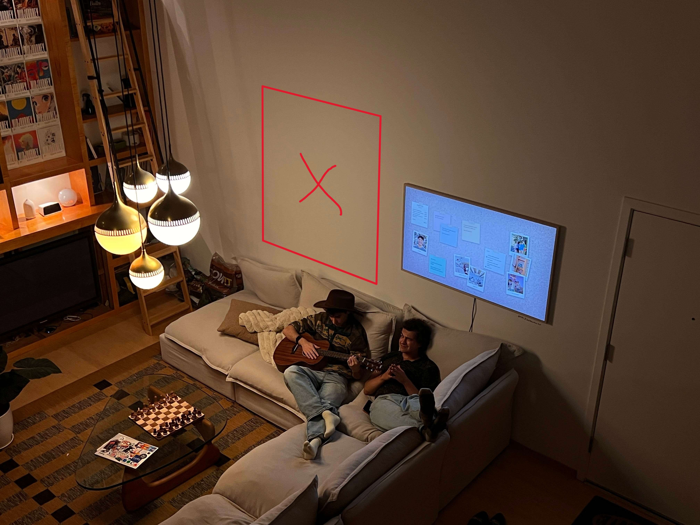
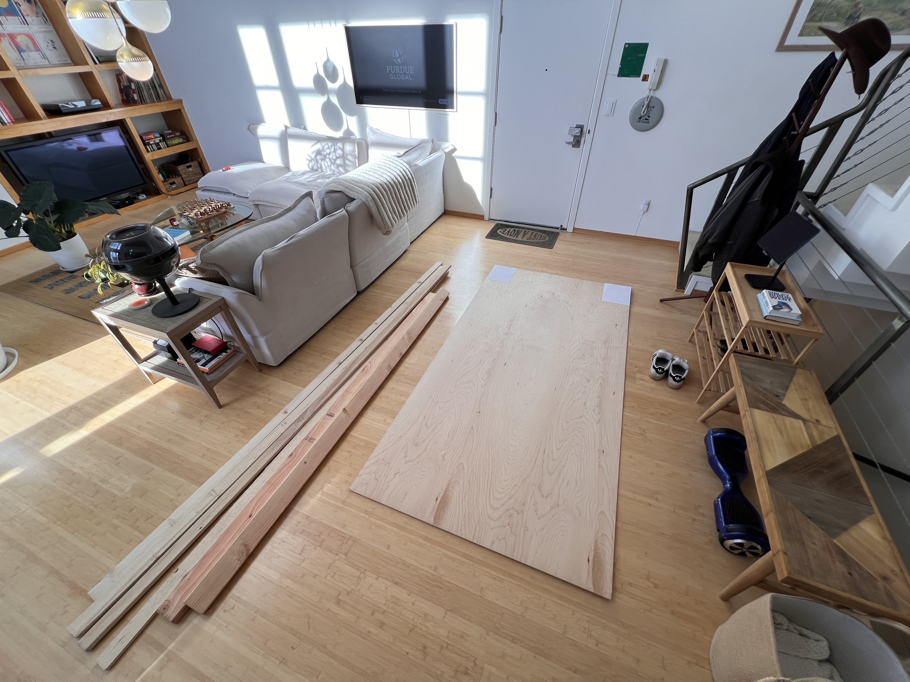
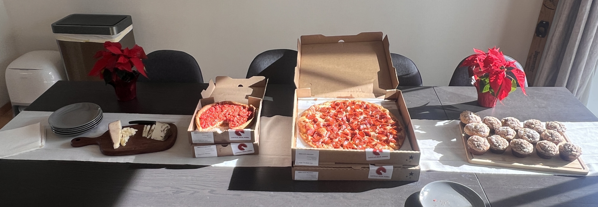
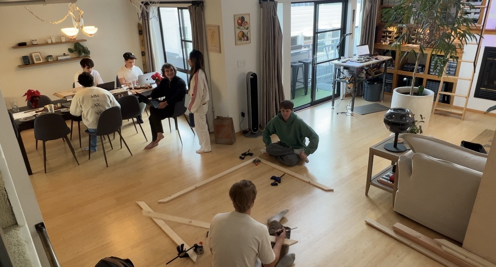
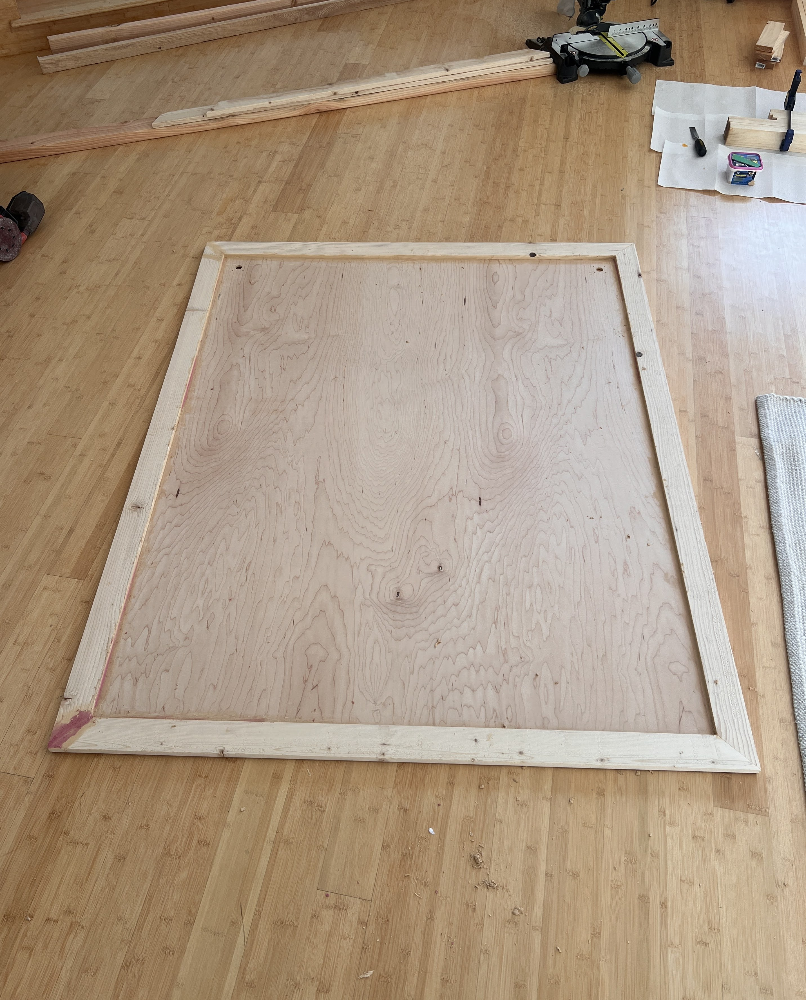
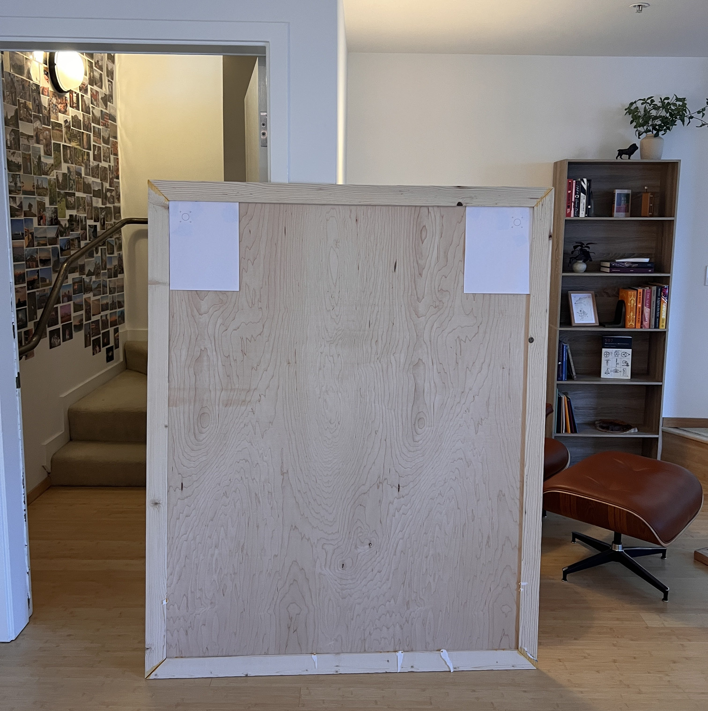
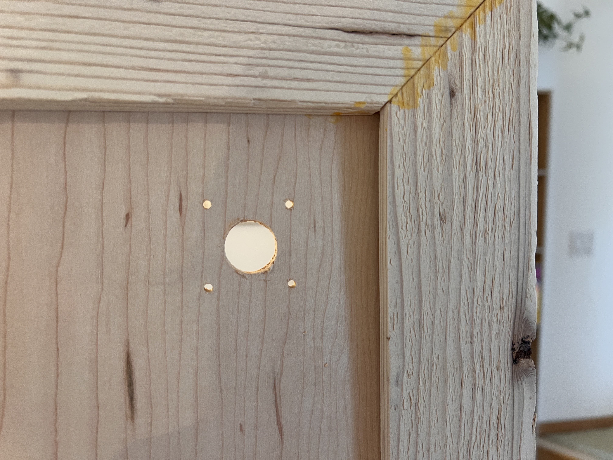
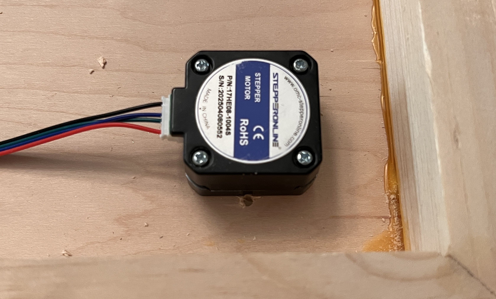
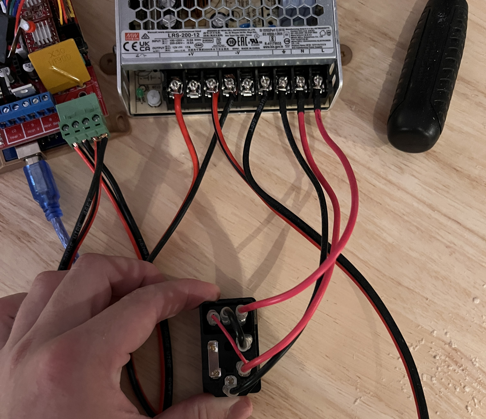
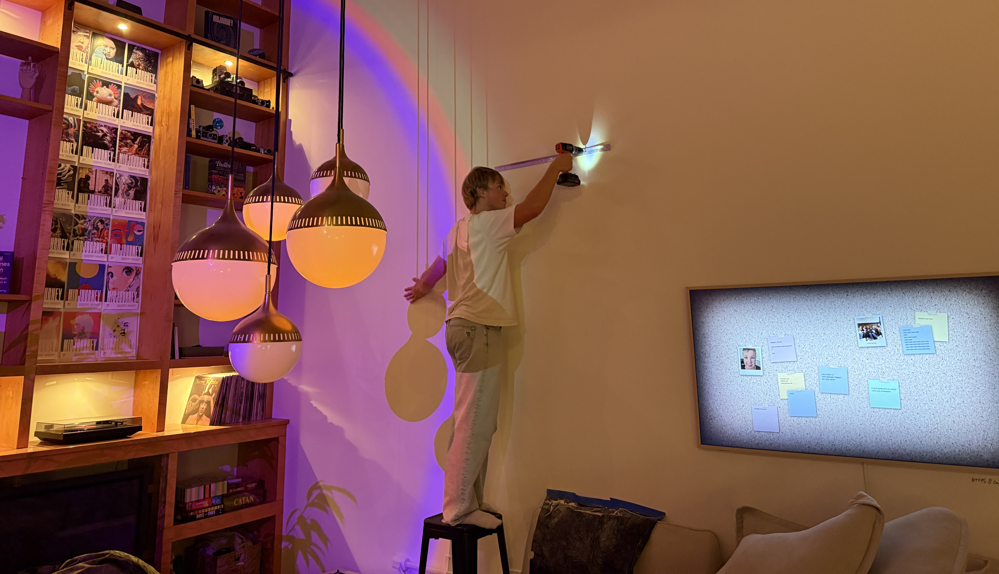

<link rel="stylesheet" href="/assets/css/projects/polargraph.css">
<link rel="stylesheet" href="/assets/css/projects/vnp.css">
<script src="/assets/js/polargraph.js" defer></script>
<script src="/assets/js/mathjax.js"></script>
<script src="https://cdn.jsdelivr.net/npm/mathjax@3/es5/tex-mml-chtml.js" async></script>

<center>
  <div style="position:relative;padding-bottom:56.25%;">
    <iframe width="100%" height="100" style="width:100%;height:100%;position:absolute;left:0px;top:0px;" src="https://www.youtube.com/embed/8UEqEzWdhAY" title="" frameborder="0" allow="autoplay; encrypted-media" allowfullscreen></iframe>
  </div>
</center>

A few years ago, back when GPT-3.5 was first released, and I still spent most of my days sitting in a highschool classroom, I had a project idea. Perhaps one of my best named project ideas to date: The *Generative Pen-trained Transformer* or GPenT for short.

GPenT was awesome, I was going to build out a color-changing pen plotter with some funky coreXY-esque kinematic, and alongside it try my hand at writing one of those [SVG Blob Generators](https://www.blobmaker.app/) to generate a bunch of shapes to draw. These 'blob' generators are simple enough, usually they take in some input variables from a user in the form of sliders, and output a downloadable SVG, yet I wanted to try my hand at something new. Instead of a UX with sliders, I would pass in a raw string of numbers into this generator, numbers generated by GPT-3.5. 

It's funny to look back at my intuition here, to use an LLM to generate a string of numbers, to generate SVG blobs, to feed to a pen plotter, and to call the whole thing the Generative Pen-trained Transformer? Being the hardware engineer I always have been, I didn't have any ML, or honestly, even much python expierence to fall back on. And for my first ever flirt with artifical intellegence, this felt like a pretty solid project. So, I got at it, starting to chip away at the kinematic and machine design, before quickly getting blindsided by the chess cheating scandal of the century, and with it, a [newer, shiner project](https://theodore.net/projects/VonNiemannProbe/). As most of my wonderfuly named project ideas (I'm slightly biased here), GPenT was back on the shelf.

???+ failure "*Failed* first attempt at GPenT"

    Below are the half-compeated remains of GPenT v1. Rest in piece(s).

    <center>
     <iframe src="https://gmail5303747.autodesk360.com/shares/public/SH90d2dQT28d5b602811b69ff174e571ad2a?mode=embed" width="100%" height="480" allowfullscreen="true" webkitallowfullscreen="true" mozallowfullscreen="true"  frameborder="0"></iframe>
    </center>

A lot has changed since my highschool days, for starters, we have GPT-5.2 now! and with it [a](https://x.com/GeoffLewisOrg/status/1945864963374887401) [whole](https://x.com/snwy_me/status/1948909735048273946) [bunch](https://x.com/deedydas/status/1962195333494313414) [of](https://x.com/davidmbudden/status/2006140494410309933) gpt induced psychosis. Also, I have my own place in San Francsico! If you've seen any of my other [recent](https://onethreenine.net/about) [projects](https://theodore.net/projects/Quotes/), you know I've been on a kick to trick this place out, and while I've been making progress on the silly, whimsical projects front, the aparmtnet walls have remained shockingly bare. So I figure its time to dust off the old Generative Pen-trained Transformer, see this, beautifuly-named, project through, and with it finally get some awesome art for my apartment.

### Wall-mounted Polargraph

What is a polargraph? and why is it wall mounted? Well, a polargraph is a verticly-mounted drawing machine, and I figure what better than art on your wall if not an epic machine that makes art on your wall!

The opperating principle of the polargraph is simple enough. Take some rectangular work area with a motor in each of the top corners, string a belt over each of those motors, append a counter weight on one side of each belt, and attach the otherside of both belts to a single gondla. This gondla will thus be moved when either motor rotates.

<div class="polargraph-diagram">
<svg viewBox="0 0 1000 700" xmlns="http://www.w3.org/2000/svg">
    <rect class="pg-frame" x="100" y="120" width="800" height="500" fill="none" stroke-width="1.5"/>
    <line class="pg-bar" x1="100" y1="120" x2="900" y2="120" stroke-width="1.5"/>
    <g id="leftMotor">
        <circle class="pg-motor-outer" cx="100" cy="120" r="22" fill="none" stroke-width="1.5"/>
        <circle class="pg-motor-outer" cx="100" cy="120" r="15" fill="none" stroke-width="1.5"/>
        <circle class="pg-motor-center" cx="100" cy="120" r="8"/>
    </g>
    <g id="rightMotor">
        <circle class="pg-motor-outer" cx="900" cy="120" r="22" fill="none" stroke-width="1.5"/>
        <circle class="pg-motor-outer" cx="900" cy="120" r="15" fill="none" stroke-width="1.5"/>
        <circle class="pg-motor-center" cx="900" cy="120" r="8"/>
    </g>
    <line id="leftCounterLine" class="pg-counter-line" x1="80" y1="120" x2="80" y2="400" stroke-width="1" opacity="0.4"/>
    <rect id="leftCounterweight" class="pg-counterweight" x="73" y="400" width="14" height="26" rx="2" stroke-width="1"/>
    <line id="rightCounterLine" class="pg-counter-line" x1="920" y1="120" x2="920" y2="400" stroke-width="1" opacity="0.4"/>
    <rect id="rightCounterweight" class="pg-counterweight" x="913" y="400" width="14" height="26" rx="2" stroke-width="1"/>
    <line id="leftBelt" class="pg-belt" x1="100" y1="120" x2="300" y2="350" stroke-width="1" opacity="0.5"/>
    <line id="rightBelt" class="pg-belt" x1="900" y1="120" x2="300" y2="350" stroke-width="1" opacity="0.5"/>
    <g id="gondola">
        <rect class="pg-gondola-body" x="-28" y="-20" width="56" height="40" rx="4" stroke-width="1.5"/>
        <circle class="pg-attachment" cx="-22" cy="-15" r="3"/>
        <circle class="pg-attachment" cx="22" cy="-15" r="3"/>
        <rect class="pg-pen-holder" x="-8" y="20" width="16" height="35" rx="2" stroke-width="1.2"/>
        <path class="pg-pen-tip" d="M -6,55 L 0,63 L 6,55 Z" stroke-width="1"/>
    </g>
</svg>
</div>

Plus, I already had a Fusion 360 folder for this project, so starting on the kinematic and machine design couldn't have been easier. There are a bunch of easy [DIY](https://www.instructables.com/Polargraph-Drawbot/) [polargraphs](https://www.thingiverse.com/thing:798076) out there on the internet that I referenced througout this design process, notably the [Makelangelo](http://www.makelangelo.com/), whose software and firmware we'll refernce later in this piece.

Given I intend to hang this polargraph above the couch in my living room, I'm taking pains to make sure it looks pretty. 

<figure markdown="1">

{width="80%"}
<br>
*Where I intend to hang the polargraph in my living room.*

</figure>

The machine will be built within a large wooden frame, which mounts flush to the wall via a french cleat system. ALl electronics and motors will sit behind this frame, between the back of the workplane and the wall, as to remain hidden out of sight. Both stepper motor axels will protroude through the workplane and will be covered by pieces which also hold endstop switches to enable homing. Counterweights, as well as the center gondla will be weight with titanium round-stock, for high density within little area. The gondla itself will be attached to the belts via swivel arms on thin 6806-2RS bearings, to allow for a smooth, constantly upright motion. The gondla is to remain flush against the workplane at all times, so a small servo within it will actuate a pen up and down into/away from the paper. These pens should be easy enough to hotswap, because we want some different colors, of course.

and boom! Easy enough, right? Here it is in all its glory:

<center>
<iframe src="https://gmail5303747.autodesk360.com/shares/public/SH90d2dQT28d5b60281169260fadfa84fc45?mode=embed" width="98%" height="520" allowfullscreen="true" webkitallowfullscreen="true" mozallowfullscreen="true"  frameborder="0"></iframe>
</center>

... and with the design out of the way, its time to make this thing real!

#### Gondla Assembly

The gondla is the real heart of this beast, so well take on it's assembly first. Our gondla here is a modified version of a Makelangelo gondla remix I found on [printables](https://www.printables.com/model/116596-makelangelo-5-wall-hanging-plotter-gondola-with-ge).

ASSEMBLY VIDEO

#### Machine Assembly

With the gondla out of the way we can continue into the rest of machine assembly, starting with the machine's wooden frame. I toyed with scrapping this frame entirly a few times, and was particularly compelled by a suggestion from my roomate to reface the wall with whiteboard wall paper and scale up the polargraph to cover the entire space. Nonethless, I progressed with this wooden frame for now (as ashtetically I like it, and it makes electronic containment straighforward), yet you can essentially mount your polargraph gondla to any verticl plane, and alter the marker it uses with very minimal modification.

I spent the better half of a morning on a plywood run with my buddy <a target="_blank" href="https://aidanjs.com/">Aidan</a>, and hauling all the lumber needed for the machine up to my walk-up unit:

<figure markdown="1">

{width="80%"}

</figure>

... which was certainly a good workout. I figured that processing all this lumber in my apartment would take quite a while solo and I was on a bit of a time crunch finishing this build, so I ordered a bunch of pizzas and had a few friends over to help out!

<figure markdown="1">

{width="80%"}

</figure>

We hacked together this frame with some 1x3" boards and a full (4x8') sheet of 1/4" maple ply. I started by cutting the 4x8' plywood sheet down to 48x60" to match the specs of the Fusion file, and immedietly realized that all the dimetions I chose for the wooden frame of this machine were somewhat abarary and kind of a pain to process actual stock wood into. I only say this in hinesight, and frankly reccomend reconsidering your machine dimetions if you're building this for yourself. 

I wanted to frame this sheet of plywood in with some miter-style boarder. I tried pulling this stunt off with a japannese handsaw and failed my angels misribly, so I wound up buying a cheap miter saw to finish the job. My buddy <a target="_blank" href="http://fabacademy.org/2021/labs/charlotte/students/graham-smith">Graham</a> and I took out a 1/4" deep dado on the back inside edge of all four plywood boards that make up this miter-frame, so that our 48x60" plywood backing can sit flush within it.

<figure markdown="1">

{width="80%"}

</figure>

Then I cut two more sets of identical miter frame boards to stack to continue our wooden frame behind the plywood sheet. This is where we'll be positioning all of the machine's electronics to remain out of view while mounted against the wall. 

And while I took the leap and bought a few proper tools for this build, this was built on the floor of my apartment afterall (I still need to find a good woodshop in San Francisco - ping me if you know a place!), and as such I had no lack of weird gaps to woodfill.

<figure markdown="1">

{width="59%" align="left"}
{width="36%" align="right"}

</figure>

I made some [printable jigs](https://github.com/Twarner491/polargraph/blob/main/hardware/StepperJig.pdf) based on my Fusion file to help place and mount the steppers on the machines plywood backing. I just mounted these in the top corners of the wooden frame with some blue tape and drilled the mounting holes out.

<figure markdown="1">

{width="41%" align="left"}
{width="55%" align="right"}

</figure>

Then came sanding, more wood filling, and more sanding to wrap up the bulk of this project's woodworking before moving onto the electronics!

#### Wireing

The electronics behind a pen plotter are really really straightforward: 2 steppers, a single servo, two endstops, not much else. I based GPenT's electronic design around a cloned Arduino Mega 2560 and a RAMPS 1.4 shield that I had laying around, but you could build this out with really any old mainboard you have laying around with minimal modification. A compleate interactive diagram of GPenT's electronics can be found below. 

To start, mount the RAMPS 1.4 shield autom the Arduino Mega, and then stack on the two A4988 stepper drivers, on the X and Y driver slots respectivly (note that these drivers arn't show in the diagram below for legibility perpouses, but I included one in a higher slot for polarity reference). Polarity matters here! Be sure you match the roentation of the single driver shows in the diagram below with both your two drivers.

<center>
  <div class="iframe-container" style="position: relative; width: 100%; padding-top: calc(max(56.25%, 400px));">
    <iframe data-src="https://app.cirkitdesigner.com/project/385dd315-bab3-483c-8288-664c570e5344?view=interactive_preview" style="position: absolute; top: 0; left: 0; width: 100%; height: 100%; border: none;" sandbox="allow-scripts allow-same-origin" tabindex="-1"></iframe>
  </div>
</center>

Then I attached a timing pulley to each of our two steppers ...

<figure markdown="1">

{width="98%"}

</figure>

and wired both motors to the corresponding X and Y motor headers on the RAMPS shield, before mounting both steppers to our wooden backing.

Next up, the endstops. I wired our two endstops on `X-MIN` and `Y-MIN` on the RAMPS shield and used a bit of hotglue to mount them inplace on our motor covor brackets. *See both these mounted switches, as wella s our moutned steppers below*.

<figure markdown="1">

{width="44%" align="left"}
{width="52%" align="right"}

</figure>

Now, these motor covor brackets need to sit on the front side of our machine, so to pass the cables for the switch and servo through to the front, I drilled a small hole close to the mounted stepper ...

<figure markdown="1">

{width="80%"}

</figure>

before passing the cables through those holes and hot gluing the motor cover in place. The gondla servo is wired to `SERVO0` on the RAMPS shield and its cables are passed from the front to the back alongside the endstop cables under the right motor cover.

To position the motor covers proerply I mounted endcaps atop both stepper motor axis (see mounting on the right below). On the back of the machine I mounted our [Arduino + RAMPS shield](https://www.thingiverse.com/thing:2762130/files), our [Raspberry PI](https://www.printables.com/model/779342-raspberry-pi-5-case-incl-slim-and-m2-hat-version), the PSU, and the [buck boost converter](https://www.printables.com/model/123626-box-enclosure-for-buck-boost-dc-converter-board) with a bit of hotglue, before routing all of the wires with, you guessed it, even more hot glue.

<figure markdown="1">

{width="47.5%" align="left"}
{width="44%" align="right"}

</figure>

The power for the whole machine is passed through a C14 rocker socket which i have inlayed in the side of GPenT's wodden frame (with some drilled holes and some chisseling). This is wired directly to our PSU which is attached to the pwoer sockets on the RAMPS shield, as well as to a buck boost converter where its stepped down to 5V and routed to our raspberry pi. Finally the raspberry pi is connected to the Arduino mega via a USB cable.

<figure markdown="1">

{width="44%" align="left"}
{width="52%" align="right"}

</figure>

Wireing done! Onto firmware.

#### Firmware

The firmware behind pen plotters are about as easy as it gets (given that easy enough wiring from above). I'm using [Marlin](https://marlinfw.org/) as a base, and starting with the same config as the [Makelangelo firmware](https://github.com/Twarner491/Makelangelo-firmware) for compatibility out of the bok with the Makelangelo software, more on that later. 

To start I modified the stock Marlin firmware to target an Arduino Mega 2560 with a RAMPS 1.4 shield to match our machine, set our two NEMA 17 stepper motors on the X and Y driver slots (left and right belts respectivly), set our pen-lifting servo on `SERVO0` (pin 11), and the two endstops on `X-MIN` and `Y-MIN`. All extra pizzaz like LCD screens, SD cards, heated beds, etc, etc I disabled to streamline the builds. See these configuration changes for yourself in [`src/local_config.h`](https://github.com/Twarner491/Makelangelo-firmware/blob/master/src/local_config.h) and the PlatformIO build environment in [`platformio.ini`](https://github.com/Twarner491/Makelangelo-firmware/blob/master/platformio.ini#L194-L216).

To build and upload this firmware for yourself, you'll need to install the PlatformIO Core and clone my firmware repository

  ```bash
  git clone https://github.com/Twarner491/Makelangelo-firmware.git
  ```

Then connect your Arduino Mega to your computer via USB. When connecting any machines to your computer, be weary the machine's PSU is on and powered in before connecting the machine via USB. If you don't do this, you run this risk of powering your steppers through your mainboard/laptop USB power, frying your mainboard and USB port in the process!

Note the COM port of your Arduino (e.g., `COM3` on Windows, `/dev/ttyUSB0` on Linux). Then open a terminal in the [`Makelangelo-firmware`](https://github.com/Twarner491/Makelangelo-firmware.git) directory and run:

   ```bash
   pio run -e custom-polargraph --target upload --upload-port YOUR_COM_PORT
   ```
  
Replacing `YOUR_COM_PORT` with your actual port. The firmware will compile and flash automatically.

Then, with the Arduino still connected, run the included [test script](https://github.com/Twarner491/Makelangelo-firmware/blob/master/test_hardware.py) with:

   ```bash
   pip install pyserial
   python test_hardware.py
   ```

This will verify your servo moves between pen-up (90°) and pen-down (40°) positions, and that both stepper motors respond to movement commands in both directions. If eveverything moves as expected here, congrats! You're done with the phsyical build :)

<center>
  <div style="position:relative;padding-bottom:56.25%;">
    <iframe width="100%" height="100" style="width:100%;height:100%;position:absolute;left:0px;top:0px;" src="https://www.youtube.com/embed/ZFyQTihnSG4" title="" frameborder="0" allow="autoplay; encrypted-media" allowfullscreen></iframe>
  </div>
</center>

If you're building a machine of your own, you can set/refine your dimetions easily with this little [`calibrate.py`](https://github.com/Twarner491/polargraph/blob/main/tools/calibrate.py) script I wrote (this is also in the /settings tab on [plotter dot local](#plotter-dot-local), more on that UI later). I found even while building my machine to scale set in CAD, my actual machine dimetions were ever so slightly off, which can have notable impact on the polar grid. Easy fix, properly calibrate your machine!

---

To mount the whole thing to the wall I used this cheap, 30 in. 300lb. [french cleat](https://www.homedepot.com/p/OOK-30-in-300-lbs-Picture-and-Mirror-French-Cleat-Hanging-System-534269/302022526) from Home Depot. I screwed the top cleat to the top board of GPenT's wooden frame, and then mounted the bottom cleat to my wall. Pardon my lack of ladder, lol.

<figure markdown="1">

{width="80%"}

</figure>

... and here's the mounted machine, in all its glory!

<figure markdown="1">

{width="80%"}

</figure>

#### BOM

The full project repo is at [github.com/Twarner491/polargraph](https://github.com/Twarner491/polargraph). Here's all you need:

| Qty | Description | Price | Link | Notes |
|-----|-------------|-------|------|-------|
| 1 | Raspberry Pi 5 | $89.94 | [Link](https://a.co/d/dyTlgbf) | 8GB |
| 1 | Raspberry Pi 5 Active Cooler | $9.90 | [Link](https://a.co/d/6Sutyoc) | |
| 1 | Micro SD Card | $16.68 | [Link](https://a.co/d/08aiL8c) | ≥32GB |
| 1 | RAMPS 1.4 Shield | $9.39 | [Link](https://a.co/d/3rHvSAe) | |
| 2 | A4988 Stepper Drivers | $9.98 | [Link](https://a.co/d/6jOYF00) | |
| 2 | Nema 17 Pancake Stepper | $21.00 | [Link](https://a.co/d/hQhMUgQ) | 42mm x 23mm |
| 1 | MG90S Micro Servo | $9.99 | [Link](https://a.co/d/3pr14TO) | 9G |
| 2 | Stepper Motor Cables | $10.99 | [Link](https://a.co/d/flOQFlG) | 2M length |
| 2 | GT2 Timing Belt | $19.98 | [Link](https://a.co/d/0sSRB86) | 6mm width, 5M length |
| 2 | GT2 Timing Belt Pulley | $6.99 | [Link](https://a.co/d/f0aVCd0) | 16 Teeth, 5mm bore |
| 2 | 6806-2RS Ball Bearings | $30.00 | [Link](https://a.co/d/bBzQpT1) | 30mm x 42mm x 7mm |
| 1 | 12V Power Supply | $35.00 | [Link](https://a.co/d/4VRNVeE) | |
| 1 | DC/DC Buck Boost | $9.99 | [Link](https://a.co/d/4VjRFCV) | |
| 1 | C14 AC Inlet | $9.04 | [Link](https://a.co/d/cOKApD8) | |
| 1 | AC Power Cord | $9.39 | [Link](https://a.co/d/cSoMPGb) | Down angle |
| - | 14 Gauge Wire | $13.99 | [Link](https://a.co/d/foroDOo) | A couple feet |
| 2 | Limit Switch | $5.99 | [Link](https://a.co/d/g3yMx06) | |
| 3 | Tungsten Weights | $89.97 | [Link](https://a.co/d/cDbMPfC) | |
| 1 | 1/4" Maple Plywood | $37.71 | [Link](https://www.lowes.com/pd/Top-Choice-SkyPly-1-4-in-HPVA-Maple-Plywood-Application-as-4-x-8/1000083311) | 4'x8' sheet |
| 4 | 1"x3" Spruce Pine Boards | $27.92 | [Link](https://www.lowes.com/pd/1-in-x-3-in-x-8-ft-Spruce-Pine-Fir-Furring-Strip/5014776481) | 8' length |
| 1 | Wood PLA | $25.99 | [Link](https://a.co/d/3KssEbi) | 1.75mm, 1 spool |
| 1 | A0 Paper Roll | $29.86 | [Link](https://a.co/d/975QRh0) | 36" x 1200" |
| 1 | SAKURA Pigma Micron 05 Pens | $20.97 | [Link](https://a.co/d/biEOxVS) | Multicolor pack |
| 1 | French Cleat | $31.00 | [Link](https://www.homedepot.com/p/OOK-30-in-300-lbs-Picture-and-Mirror-French-Cleat-Hanging-System-534269/302022526) | 30 in. 300 lbs. |
| 1 | Felt Pads | $9.97 | [Link](https://www.homedepot.com/p/Everbilt-Assorted-Beige-Self-Adhesive-Round-Furniture-Sliders-Furniture-Pads-for-Hard-Floors-Surface-Bumpers-Value-Pack-108-Pc-49032/206855255) | Assorted Pack |
| - | M2 and M3 Hardware | - | - | Misc nuts and bolts |
| - | Jumper Wires | - | - | Misc |

*Total: ~$595.82*

### Plotter [dot] Local

I hinted earlier at the real reason we're sticking around this Makelanglo firmware so much: the [Makelangelo software](https://github.com/Twarner491/Makelangelo-software). This this is great, it bakes a full CNC controll UI with a bunch of fun turtle scripts to generate little patterns for the plotter to draw. I figure this is a great base to build on, especially all these little turtle scripts, but I like all of my projects to be entirly stand alone, meaning we're gonna need a web server and we've got some work ahead of us.

...

Just kidding, I wrote it already! I'm hosting a publically accessible version of the site at [plotter.onethreenine.net](https://plotter.onethreenine.net/), which you can use to create and export plotter compatable gcode/SVG files for yourself! Try it out below:

<center>
  <div class="iframe-container" style="height: 700px;">
    <iframe
      class="plotter-iframe"
      data-src="https://plotter.onethreenine.net/"
      frameborder="0"
      width="100%"
      height="700"
      sandbox="allow-scripts allow-same-origin allow-forms"
      tabindex="-1"
    ></iframe>
  </div>
</center>

If you've been following along and building a machine of your own, we'll want to get this UI up and running on your machines Raspberry Pi. To start, get a fresh copy of  Raspberry Pi OS Lite (64-bit) onto an SD card and update the WiFi credentials. Then lets SSH in and get to work:

  ```bash
  # SSH into your Pi
  ssh pi@raspberrypi.local  # Default password is usually 'raspberry'

  # Update system
  sudo apt update && sudo apt upgrade -y
  ```

I like custom hostnames, as I've got way to many RPI's on my network. We'll set the hostname to 'plotter' - this allows users to navigate to `plotter.local` to access the web interface.

  ```bash
  # Set hostname
  sudo hostnamectl set-hostname plotter

  # Update hosts file
  sudo nano /etc/hosts

  # Change the line: 127.0.1.1 raspberrypi
  # To: 127.0.1.1 plotter
  # Save: Ctrl+O, Enter, Ctrl+X

  # Reboot to apply
  sudo reboot
  ```

After reboot, reconnect with:

  ```bash
  ssh pi@plotter.local
  ```

Then install dependencies:

  ```bash
  # Install system packages
  sudo apt install -y python3-pip python3-venv avahi-daemon git

  # Enable and start mDNS service
  sudo systemctl enable avahi-daemon
  sudo systemctl start avahi-daemon
  ```

Now we'll clone the project repository. The full source lives at [github.com/Twarner491/polargraph](https://github.com/Twarner491/polargraph):

  ```bash
  git clone https://github.com/Twarner491/polargraph.git ~/polargraph
  cd ~/polargraph

  # Create virtual environment
  python3 -m venv venv
  source venv/bin/activate

  # Install Python dependencies
  pip install -r requirements.txt
  ```

To get our RPI app up and running with the plotter, we need to set USB permissions for the serial connection.

  ```bash
  sudo cp system-config/99-polargraph.rules /etc/udev/rules.d/
  sudo udevadm control --reload-rules
  sudo udevadm trigger

  # Add user to dialout group for serial access
  sudo usermod -a -G dialout pi

  # Reboot for permissions to take effect
  sudo reboot
  ```

As a final step, we'll set up this Flask server to auto-run upon boot.

  ```bash
  sudo cp ~/polargraph/system-config/polargraph.service /etc/systemd/system/
  sudo systemctl daemon-reload
  sudo systemctl enable --now polargraph.service

  # Check status
  sudo systemctl status polargraph.service

  # Test reboot
  sudo reboot
  ```

After reboot, http://plotter.local should be live automatically!

<center>
  <div style="position:relative;padding-bottom:56.25%;">
    <iframe width="100%" height="100" style="width:100%;height:100%;position:absolute;left:0px;top:0px;" src="https://www.youtube.com/embed/8UEqEzWdhAY" title="" frameborder="0" allow="autoplay; encrypted-media" allowfullscreen></iframe>
  </div>
</center>

If you saw my [Quote Receipt](https://theodore.net/projects/Quotes) project, you'll know I like to route all of my locally hosted projects through a Home Assistant Yellow in my apartment, so they're accessible from anywhere in the world. This is totally optional, but if you happen to have a home assistant setup of your own, you can port plotter.local to a public facing domain of your choosing:

???+ example "Home Assistant Integration (Optional)"

    Our setup here is about the same as our [Quote Receipt](https://theodore.net/projects/Quotes) setup: a webhook automation in Home Assistant receives commands from the frontend, publishes them to an MQTT topic, and an MQTT subscriber script on the Pi listens for messages and triggers the plotter. This allows the frontend to be hosted publicly (via `plotter.onethreenine.net`) while the plotter itself remains on the local network, bridged through Home Assistant.

    **Home Assistant Automation**

    Add to `automations.yaml`:

    ```yaml
    alias: "Polargraph Command"
    trigger:
      - platform: webhook
        webhook_id: polargraph_command
        allowed_methods: [POST]
        local_only: false
    action:
      - service: mqtt.publish
        data:
          topic: "home/polargraph/command"
          payload_template: "{{ trigger.json | tojson }}"
    ```

    **Enable CORS**

    Add to `configuration.yaml`:

    ```yaml
    http:
      cors_allowed_origins:
        - https://plotter.onethreenine.net
    ```

    **Pi MQTT Setup**

    Edit [`src/mqtt_subscriber.py`](https://github.com/Twarner491/polargraph/blob/main/src/mqtt_subscriber.py) with your MQTT broker IP:

    ```python
    MQTT_BROKER = "192.168.1.XXX"  # Your Home Assistant IP
    ```

    Then enable the MQTT service:

    ```bash
    sudo cp system-config/polargraph-mqtt.service /etc/systemd/system/
    sudo systemctl daemon-reload
    sudo systemctl enable --now polargraph-mqtt.service
    ```

    **Frontend Configuration**

    Edit `build_static.py` and set your webhook URL:

    ```python
    HA_WEBHOOK_URL = "https://your-ha-instance.duckdns.org/api/webhook/polargraph_command"
    ```

#### Sonakinatography

I've always really enjoyed pen plotter art, or frankly, any thin line drawings. One of my favorite twitter accounts is [@adamfuhrer](https://x.com/adamfuhrer?lang=en), who fills my timeline with a ton of asthetic plots/sketches. One of his recent tweets really caught my eye, highlighting the works of Channa Horwitz:

<center>
  <br>
  <div class="tweet-container">
    <div class="tweet-item single">
      <span class="lighttweet"><blockquote class="twitter-tweet"><p lang="en" dir="ltr">channa horwitz <a href="https://t.co/WhdBnXdFH6">pic.twitter.com/WhdBnXdFH6</a></p>&mdash; Adam Fuhrer (@adamfuhrer) <a href="https://twitter.com/adamfuhrer/status/2000714242945622078?ref_src=twsrc%5Etfw">December 15, 2025</a></blockquote> <script async src="https://platform.twitter.com/widgets.js" charset="utf-8"></script></span>
      <span class="darktweet"><blockquote id='tweet' class="twitter-tweet" data-theme="dark"><blockquote class="twitter-tweet" data-theme="dark"><p lang="en" dir="ltr">channa horwitz <a href="https://t.co/WhdBnXdFH6">pic.twitter.com/WhdBnXdFH6</a></p>&mdash; Adam Fuhrer (@adamfuhrer) <a href="https://twitter.com/adamfuhrer/status/2000714242945622078?ref_src=twsrc%5Etfw">December 15, 2025</a></blockquote> <script async src="https://platform.twitter.com/widgets.js" charset="utf-8"></script></span>
    </div>
  </div>
  <br>
</center>

Horwitz invented a complete visual notion system constrained to 1/8" graph paper several decades ago (1968), which she coined: Sonakinatography. All of here works were done entirly by hand which is absoutly bonkers, as they're so meticulous they look computer generated. While I'm not quite confiden I hold a steady enough hand to pratice these plots true to her method, I now happen to own a wonderful, wall-mounted polargraph!

In sonakinatography, there are 8 entites, each given a corresponding number. Each entity occupies a certain number of grid squares on 1/8" graph paper, corresponding to the number of "beats" present within that entity. In this sense, duration of an entity (or beat count) is equivalant to its visual magnitude. While you can use this method to vizualize a whole bunch of data and a whole bunch of itnresting fashions, I'm going to constrain our entity type for now into poems and phrases (as beat count feels particurlary opbious here). We'll map each work in a poem/phrase to an entity (1-8) based on its syllable count.

$$\text{word} \xrightarrow{\text{syllable count}} \text{entity } n \in \{1,2,3,4,5,6,7,8\}$$

A one syllable word becomes entity #1 (and occupies 1 beat), a two syllable word becomes entity #2 (and occupies 2 beats), and so on. The poem/phrase reads left to right across the 8 column grid, with each word placed sequentially. The vertical axis here shows termporal progression through the poem/phrase, and the resulting pattern visualizes the poem/phrase's rhythmic structure as a landscape of rising and falling durations.

Try some of this pome/phrase constrained sonakinatography out for yourself:

<div class="sonakinatography-demo">
  <div class="sono-input-section">
    <div class="sono-examples">
      <button class="sono-example-btn" data-example="pangram">Pangram</button>
      <button class="sono-example-btn" data-example="frost">Frost</button>
      <button class="sono-example-btn" data-example="shakespeare">Shakespeare</button>
      <button class="sono-example-btn" data-example="dickinson">Dickinson</button>
      <button class="sono-example-btn" data-example="haiku">Haiku</button>
    </div>
    <textarea class="sono-textarea" placeholder="Enter a poem, phrase, or any text to visualize as Sonakinatography... (Ctrl+Enter to generate)"></textarea>
  </div>
  
  <div class="sono-controls">
    <label for="sono-algorithm">Algorithm</label>
    <select id="sono-algorithm">
      <option value="letter">Letter Position (A→1, B→2...)</option>
      <option value="syllable">Syllable Count</option>
    </select>
    <button class="sono-generate-btn">Generate</button>
  </div>
  
  <div class="sono-visualization">
    <div class="sono-canvas-container">
      <div class="sono-empty-state">
        <svg viewBox="0 0 100 100" xmlns="http://www.w3.org/2000/svg">
          <rect x="10" y="10" width="20" height="20" fill="none" stroke="currentColor" stroke-width="2"/>
          <rect x="35" y="10" width="20" height="40" fill="none" stroke="currentColor" stroke-width="2"/>
          <rect x="60" y="10" width="20" height="30" fill="none" stroke="currentColor" stroke-width="2"/>
          <rect x="10" y="35" width="20" height="10" fill="none" stroke="currentColor" stroke-width="2"/>
          <rect x="60" y="45" width="20" height="20" fill="none" stroke="currentColor" stroke-width="2"/>
        </svg>
        <p>Select an example or enter text above</p>
      </div>
      <div class="sono-svg-container"></div>
      <p class="sono-note">* Visualization rotated 90° from Horwitz's vertical format for space efficiency</p>
    </div>
  </div>
</div>

#### dcode

All these turtle scripts and sonakinatography algorithims are cool, but this is the Generative Pen-trained Transformer after all! I certainly can't call this project compelate without some ML shennigans.

I've had this network I've been wanting to train for a while and finally found a good excuce in this project: [`dcode`](https://github.com/Twarner491/dcode), text to gcode difusion. I took a simple enoguh approach here: take Stable Diffusion's visual understanding and then redirect it. Instead of decoding latents into pixels via Stable Difusion's VAE, I'm attempting to decode them to gcode via a transformer. The whole end to end process flushes out to Text prompt → CLIP → UNet diffusion → latent → gcode decoder → plotter-ready commands.

I started by building out a dataset of image-gcode pairs by by running art images from the an dataset of images of pieces of art I found on [Kaggle](https://www.kaggle.com/datasets/thedownhill/art-images-drawings-painting-sculpture-engraving) through five vectorization algorithms, each captioned with BLIP. 

My first training attempt I trained this decoder on whatever latents the difussion process produced which in hinesight was a bit silly, as these latest are noisly by design, and as such there was no stable signal for the decorder to learn from and the model collased. I pvoited to using VAE econded image latence, which deterministically map each image to some fixed latent, giving me the consisrtency I needed for my decoder training targets. 

This seemingly worked structrually, and my next attempt at the network learned gcode syntax, but output the same coordinate over and over again. My best guess was that this decoder was too small, so the final piece of this puzzle was scale ... I wish. I scaled up my network to a 200M parameter transformer decoder with a CNN based latent projector, and ran 20 epochs across 8x H100s and saw a loss drop from 3.7 to 0.17! However, semantic understanding remains incredibly limited. The model learned gcode strcture but not meaningful content - here's its attempt at "a sketch of a horse" for isntance, lol.

<figure markdown="1" style="opacity:90%;">

 {width="70%" alt="dcode attempt at a horse"}
 {width="70%" alt="dcode attempt at a horse"}

</figure>

The fundimental chalange here is that the latent space learned by Stable Diffusion's VAE is optomize, of course, for pixel reconstruction, not gcode path planning. A true dcode, text to gcode model likely needs to be trained end-to-end with gcode as the target modality. I would realy really like to get one of these working sometime soon, but for now, my compute budget is depleted (those H100's are expensive man!)

Nonethless, the network in its current state is available on [HuggingFace](https://huggingface.co/twarner/dcode-sd-gcode) as well as baked into the plotter [dot] local interface so you can [try it out](https://huggingface.co/spaces/twarner/dcode) for yourself!

!!! quote ""

      <center>
        <div class="iframe-container" style="height: 725px;">
          <iframe data-src="https://twarner-dcode.hf.space" frameborder="0" width="100%" height="725" sandbox="allow-scripts allow-same-origin allow-forms" tabindex="-1"></iframe>
        </div>
      </center>

#### GPenT

The final generator in plotter [dot] local brings us back to the orgins of this project: it's time to implement the Generated Pen-trained Transformer itself. I figure its best to return back to my inital intuition: "to use an LLM to generate a string of numbers, to generate SVG blobs, to feed to a pen plotter, and to call the whole thing the Generative Pen-trained Transformer". Except now theres no need to limit ourselves to SVG blobs, we have a bunch of generators to work with!

I built out a super simple Gemini instance to handel this. I pass in some keyword (a "whisper" of inspiration if you will) into the Gemini API, as well as a randomized list of generators and color options in a structured prompt that gives Gemini control over the pen plotter. The model then resonds with JSON commands specifying which genreators to run, with what parameters and transformations, and in which colors. All of this is passed into plotter [dot] local, and is plotted in the workplane.

<div class="gpent-prompt-demo">
  <div class="prompt-container">
    <pre class="prompt-text"><code>You control a pen plotter. Canvas: 841mm x 1189mm.

Whispers: "<span class="prompt-var" data-var="whisper">ocean waves</span>"

GENERATORS:
  <span class="prompt-var" data-var="gen1">9: Flow Field - options: lines (50-1000), length (10-200), scale (0.001-0.1)</span>
  <span class="prompt-var" data-var="gen2">1: Spiral - options: turns (1-50), spacing (1-20)</span>
  <span class="prompt-var" data-var="gen3">22: Kaleidoscope - options: symmetry (4-16), pattern (curves/lines/spirals/petals/geometric), complexity (5-20)</span>
  ... (25 generators, order randomized)

COLORS:
  <span class="prompt-var" data-var="color1">3: Blue</span>
  <span class="prompt-var" data-var="color2">2: Black</span>
  <span class="prompt-var" data-var="color3">4: Green</span>
  ... (9 colors, order randomized)

TRANSFORMS: scale (10-300%), rotation (0-360), offset_x (-400 to 400mm), offset_y (-550 to 550mm)

Respond with JSON array. Say FINISHED when done.
[
  {"thought": "...", "generator": &lt;num&gt;, "options": {}, "color": &lt;num&gt;, "scale": 100, "rotation": 0, "offset_x": 0, "offset_y": 0},
  ...
]</code></pre>
  </div>
</div>

I'm shuffling generator and color orderings for each request to prevent Gemini from favoring early listed options. My inital tests show this is quite effective at getting more varid results. See the fully Gemini worker source at [`workers/gpent-worker.js`](https://github.com/Twarner491/polargraph/blob/main/workers/gpent-worker.js) - this is about as minimal as it gets, it was my goal to give Gemini as 'unbiased' of a prompt as possible, yet I bet you could get some really intresting results with a bit more time spent prompting.

### Gallery

I am so stoked with how this project came together, and it feels really good to have dusted off an old project from the shelf and to have seen it through. My apartment walls are a little less bare now, I've captured some of my favorite plots, check them out: 

<!-- POLARGRAPH_GALLERY -->

<script>
(function() {
    const gondola = document.getElementById('gondola');
    const leftBelt = document.getElementById('leftBelt');
    const rightBelt = document.getElementById('rightBelt');
    const leftCounterweight = document.getElementById('leftCounterweight');
    const rightCounterweight = document.getElementById('rightCounterweight');
    const leftCounterLine = document.getElementById('leftCounterLine');
    const rightCounterLine = document.getElementById('rightCounterLine');
    
    const leftMotorX = 100, leftMotorY = 120;
    const rightMotorX = 900, rightMotorY = 120;
    
    const waypoints = [
        {x: 300, y: 350}, {x: 500, y: 250}, {x: 700, y: 350},
        {x: 700, y: 500}, {x: 300, y: 500}, {x: 400, y: 400}
    ];
    
    let currentWaypoint = 0, progress = 0;
    const speed = 0.004;
    
    function lerp(start, end, t) { return start + (end - start) * t; }
    function easeInOutCubic(t) { return t < 0.5 ? 4*t*t*t : 1 - Math.pow(-2*t + 2, 3) / 2; }
    
    function updateAnimation() {
        const current = waypoints[currentWaypoint];
        const next = waypoints[(currentWaypoint + 1) % waypoints.length];
        const easedProgress = easeInOutCubic(progress);
        
        const gondolaX = lerp(current.x, next.x, easedProgress);
        const gondolaY = lerp(current.y, next.y, easedProgress);
        
        gondola.setAttribute('transform', `translate(${gondolaX}, ${gondolaY})`);
        
        const leftAttachX = gondolaX - 22, leftAttachY = gondolaY - 15;
        const rightAttachX = gondolaX + 22, rightAttachY = gondolaY - 15;
        
        leftBelt.setAttribute('x2', leftAttachX);
        leftBelt.setAttribute('y2', leftAttachY);
        rightBelt.setAttribute('x2', rightAttachX);
        rightBelt.setAttribute('y2', rightAttachY);
        
        const leftBeltLength = Math.sqrt(Math.pow(leftAttachX - leftMotorX, 2) + Math.pow(leftAttachY - leftMotorY, 2));
        const rightBeltLength = Math.sqrt(Math.pow(rightAttachX - rightMotorX, 2) + Math.pow(rightAttachY - rightMotorY, 2));
        
        const totalBeltLength = 800;
        const leftCounterY = 120 + (totalBeltLength - leftBeltLength);
        const rightCounterY = 120 + (totalBeltLength - rightBeltLength);
        
        leftCounterweight.setAttribute('y', leftCounterY);
        rightCounterweight.setAttribute('y', rightCounterY);
        leftCounterLine.setAttribute('y2', leftCounterY);
        rightCounterLine.setAttribute('y2', rightCounterY);
        
        progress += speed;
        if (progress >= 1) {
            progress = 0;
            currentWaypoint = (currentWaypoint + 1) % waypoints.length;
        }
        requestAnimationFrame(updateAnimation);
    }
    
    updateAnimation();
})();

// Defer iframe loading until visible - prevent focus/scroll stealing
(function() {
  const observer = new IntersectionObserver((entries) => {
    entries.forEach(entry => {
      if (entry.isIntersecting) {
        const iframe = entry.target;
        const src = iframe.dataset.src;
        if (src && !iframe.src) {
          // Save scroll position
          const scrollY = window.scrollY;
          
          // Make iframe non-interactive during load
          iframe.style.pointerEvents = 'none';
          
          // Set src
          iframe.src = src;
          
          // Immediately restore scroll if it changed (happens synchronously sometimes)
          if (window.scrollY !== scrollY) {
            window.scrollTo(0, scrollY);
          }
          
          // Also check on next frame in case it's async
          requestAnimationFrame(() => {
            if (window.scrollY !== scrollY) {
              window.scrollTo(0, scrollY);
            }
            // Re-enable interaction
            iframe.style.pointerEvents = '';
          });
        }
        observer.unobserve(iframe);
      }
    });
  }, { rootMargin: '300px' }); // Load earlier so it's ready before user sees it
  
  document.querySelectorAll('iframe[data-src]').forEach(iframe => {
    observer.observe(iframe);
  });
})();
</script>
