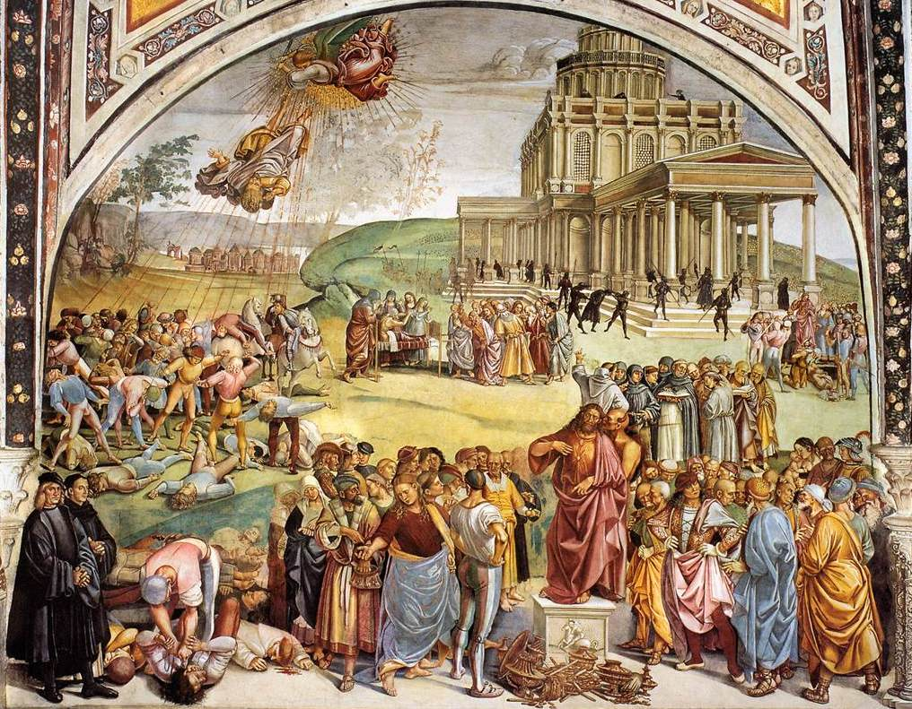
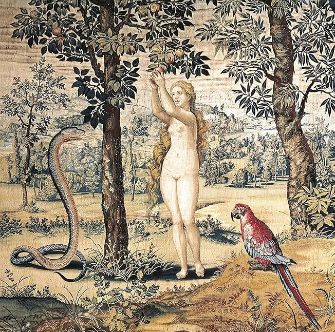
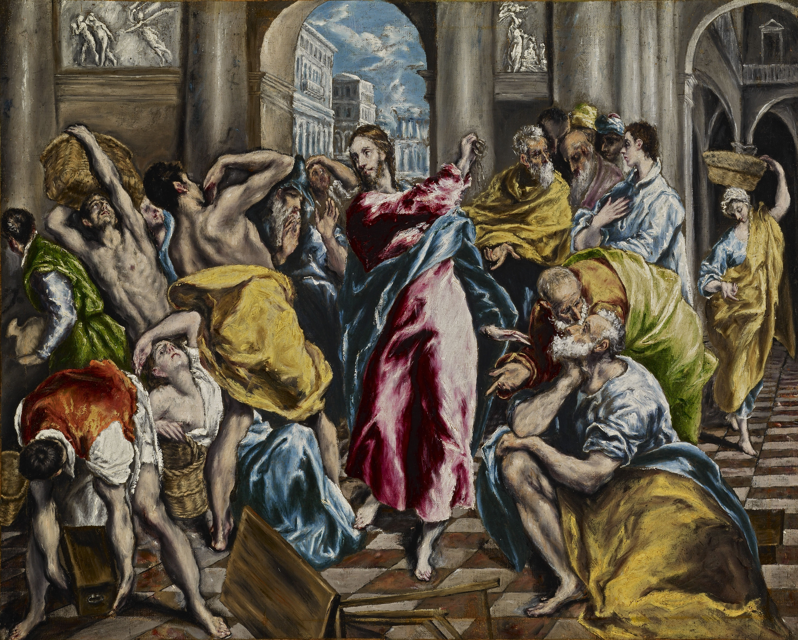
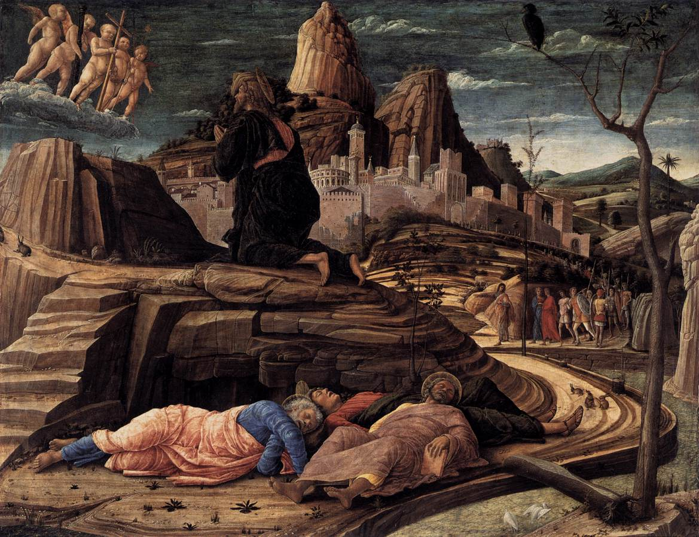

{.epigraph}
> You will not die. For God knows that when you eat of it your eyes will be opened, and you will be like gods, knowing good and evil.
> - <cite>Genesis</cite> 3:4-5
{/.epigraph}

{.newthought}"There has risen from the sea a beast{/.newthought}, full of words of blasphemy… carefully examine the head, the middle, and the lower parts of this beast Frederick, the so-called emperor," wrote Pope Gregory IX to the Archbishop of Canterbury in 1239.{.sidenote}Gregory IX, Ascendit de mari (1239). Cf. Philip Schaff, History of ~the Christian Church, vol. V (1882).{/.sidenote} Emperor Frederick II fired back in a circular letter, calling the Pope himself "in verity Antichrist." Three centuries later, Martin Luther received the papal bull threatening his excommunication and replied: "I ask thee, ignorant Antichrist, dost thou think that with thy naked words thou canst prevail against the armor of Scripture?"{.sidenote}Martin Luther, Against the Execrable Bull of Antichrist (1520). Cf. Roland Bainton, Here I Stand (1950), 153-155.{/.sidenote} He later wrote, with something like relief: "I feel much freer now that I am certain the pope is Antichrist."{.sidenote}Luther, Table Talk.{/.sidenote} Tsar Alexander called Napoleon "the Anti-Christ and the enemy of God." Russian Orthodox clergy told their peasants the French were "a legion of devils commanded by the Anti-Christ."{.sidenote}Irina Pochinskaya, The Image of Napoleon in the Context of Old Believer Eschatology (Ural Federal University, 2020).{/.sidenote} Emperor and Pope. Reformer and Rome. Tsar and conqueror. For centuries the accusation of being Antichrist was the most serious opprobrium in Christendom, and it was deployed constantly.

Then we stopped.

In our ever-secular world, the discussion has altogether dropped. For centuries, Christians talked about Antichrist constantly - accused each other of being him - and the discourse, whatever its excesses, kept a certain vigilance alive. Recently, in certain intellectual circles, the conversation has returned. Good. Anything we used to talk about this much, that we no longer discuss at all, is worth considering. And so I would like to stoke the flames.

### The Promise Without God

> *"But what is the absolute meaning of this drama? I still do not understand why the Anti-Christ hates God so much, while he himself is essentially good, not evil. ... That is the point. He is not *essentially* evil ... He can be explained by a simple proverb: 'all that glitters is not gold.'"*{.sidenote}Vladimir Solovyov, "A Short Tale of the Anti-Christ," in *War, Progress, and the End of History* (1900).{/.sidenote}

The promise of Antichrist is the promise of God, without God.{.marginfigure} Luca Signorelli, *Sermon and Deeds of Antichrist* (1499-1502){/.marginfigure} Achieving all that alignment with God's will promises - peace, mercy, justice, equality - without God. The pinnacle of our secular perversion of virtue and justice. And, in this, the word of Christ is fulfilled:

> *"I have come in my Father's name, and you do not accept me. Another will come in his own name - him you will accept."*
> - *John* 5:43

For it is necessary to be *agreeable* to be *accepted*.

It becomes ever clearer that humanity can build our pyre ever higher, pursuing peace, mercy, justice, equality. And yet without the spark of God to light our pyre ablaze, we are left in the perverted cold. Just as a cold, unlit stack of wood provides no warmth to man, regardless of how tall the pile of logs has been tediously stacked, so too our acts of "faith" and "love" give us nothing without the spark of God - without the hope that our pyre will be lit, that we will experience our warmest warm.

Antichrist is the greatest pyre-builder in human history. He delivers peace.{.marginnote}"What should one think of a world peace - a peace that was not the peace of Jesus Christ?" (Benson, *Lord of the World*, 1907).{/.marginnote} He eliminates poverty. He offers bread and games. As Solovyov writes: "The most fundamental form of equality was firmly established among humankind, the *equality of universal satiety*." He stacks the pyre higher and higher ... and it is cold. 

Yet, peace and safety do not seem bad,and in fact they are not - necessarily. The Church itself searches after peace and justice, Our Lord taught us by example  "that we too must shoulder that cross which the world and the flesh inflict upon those who search after peace and justice.{.sidenote}*Gaudium et Spes* (1965), §38.{/.sidenote}. So, why is Antichrist necessarily bad? Our fall may help us understand why.

### Paradise Gained?

{.newthought}Barthélemy observes that{/.newthought} "the tree of the knowledge of good and evil" cannot denote mere experience of good and evil, since man already possessed the freedom to do good or evil. What, then, was forbidden of us? "The tree of the knowledge of good and evil denotes the possibility of man determining for himself what is good and what is evil, in other words, of becoming the principle of his own moral conscience."{.sidenote}Dominique Barthélemy O.P., *God and His Image: An Outline of Biblical Theology*, 1966. pp. 23-24, 27{/.sidenote} In the Garden of Eden, when the serpent says "you will become like gods," the implicit lie is that we are not already "like" God. In paradise we were aligned with the beatific vision. We were aligned with Our Lord. And in original sin we severed ourselves from this - we clouded our vision. Through this reading, it is not the consumption of the apple{.marginfigure} Pieter Coecke van Aelst, *Original Sin*, c. 1548–1551{/.marginfigure} that is our sin, but rather the indulgence of doubt in the first place. 

The most perverse thing we could do is to define our own morality. To construct definitions of virtue, justice, peace, and safety which are necessarily incorrect or misled unless our ground truth is Our Lord. Eve's doubts inspire a sort of perverse hope - a hope which is unaligned, perhaps slightly, perhaps entirely, with the will of God.

If we consider that hope was unnecessary in the Garden - for to hope for anything besides the Garden would be necessarily perverse - we may even go as far as to say: the first hope was perverse. "Hope" has perverse origins in original sin, the hope to be "like gods." And it is only after the Fall that a new type of hope is introduced - the hope to be aligned with God again, aligned to His beatific vision. "Man will quickly realize that he is not a god; he will quickly realize that this lost paradise was the only possible place to find happiness."{.sidenote}Barthélemy, *God and His Image*.{/.sidenote} Man did not need hope before original sin. Only now must we hope to return to the paradise we have lost.

If you are already in paradise, to hope for something else is always perverse.

One may read Antichrist as the logical extreme of this perverse hope, the ultimate indulgence into the belief that man may be 'like gods'.  Humanity's hubris in thinking it possible to define virtue, justice, peace, and safety ourselves, and actually achieve this, in a secular, fleeting, perverse sense{.marginnote}Solovyov: "Humanity had outgrown that stage of philosophical infancy. On the other hand, it became equally evident that it had also outgrown the infantile capacity for naive, unconscious faith." Antichrist's world is one in which we begin to achieve what is promised in God, but without God.{/.marginnote} - this is where we see the completion of original sin. The peace and safety of Antichrist are necessarily bad, as they forgo *theia moira*, divine dispensation.

The serpent promised that we would be like gods. Antichrist delivers on that promise. He offers paradise regained - on human terms, in human time, by human effort. And yet it is the same perversion, the same severing from God, the same cold pyre.

### The Infinite Delta

Consider our scene of Jesus in the temple,{.marginfigure} El Greco, *Christ Driving the Money Changers from the Temple* (c. 1600).{/.marginfigure} flipping over tables, claiming that they have disgraced *his Father's* house. How absolutely ludicrous! In fact this is such an absurd scene that it demands a polarity: regardless of how morally good Jesus was, regardless of how faithful and loving his teachings are, he is claiming to be the Son of God. And so either he is the Son of God, or he is not, and if he is not, the ridiculousness of this claim washes over all possible, empirical goods done by Jesus.{.sidenote}Cf. Lewis, *Mere Christianity* (1952), II.3: the trilemma redeployed.{/.sidenote}

If Antichrist claims himself the highest good, the most just, but is in fact not, we may cast the same judgment. Even if Antichrist proves to be the *second* most just, most virtuous, behind only our Lord himself, the claim that he is, in fact, the *first* is as evil and terrible as the delta between the justness and virtue of Antichrist and Our Lord - which is infinite. Making this claim the furthest possible thing from Christianity. The gap between any finite good and God is not a gap of degree but of kind. It is infinite. So the second most just being, in claiming primacy, does not commit a small error. He commits the maximal possible sin. The closer he gets to the good while refusing God, the worse it is.

{.marginnote}Even if Antichrist were the second most just, most virtuous, behind only Our Lord himself - the gap between any finite good and God is not a gap of degree but of kind. It is infinite. The closer he gets to the good while refusing God, the worse it is.{/.marginnote}

<svg xmlns="http://www.w3.org/2000/svg" viewBox="0 0 700 200" font-family="var(--md-text-font-family, 'Palatino Linotype'), serif" style="width:100%;height:auto;">
  <!-- Horizontal axis -->
  <line x1="30" y1="90" x2="670" y2="90" stroke="currentColor" stroke-width="1.5"/>
  <polygon points="675,90 665,85 665,95" fill="currentColor"/>
  <text x="670" y="115" fill="currentColor" font-size="10" font-style="italic" text-anchor="end">Goodness / Justice</text>
  <line x1="50" y1="85" x2="50" y2="95" stroke="currentColor" stroke-width="1"/>
  <text x="50" y="78" fill="currentColor" font-size="10" text-anchor="middle" opacity="0.4">0</text>
  <line x1="140" y1="85" x2="140" y2="95" stroke="currentColor" stroke-width="1" opacity="0.5"/>
  <text x="140" y="78" fill="currentColor" font-size="11" font-style="italic" text-anchor="middle" opacity="0.5">man</text>
  <line x1="240" y1="85" x2="240" y2="95" stroke="currentColor" stroke-width="1" opacity="0.5"/>
  <text x="240" y="78" fill="currentColor" font-size="11" font-style="italic" text-anchor="middle" opacity="0.5">the righteous</text>
  <line x1="370" y1="85" x2="370" y2="95" stroke="currentColor" stroke-width="1.5"/>
  <text x="370" y="72" fill="currentColor" font-size="13" font-style="italic" text-anchor="middle">Antichrist</text>
  <text x="370" y="58" fill="currentColor" font-size="10" text-anchor="middle" opacity="0.5">even if "the second most just"</text>
  <text x="380" y="108" fill="currentColor" font-size="11" font-style="italic" opacity="0.5">n</text>
  <line x1="240" y1="105" x2="370" y2="105" stroke="currentColor" stroke-width="0.75" opacity="0.5"/>
  <line x1="240" y1="102" x2="240" y2="108" stroke="currentColor" stroke-width="0.75" opacity="0.5"/>
  <line x1="370" y1="102" x2="370" y2="108" stroke="currentColor" stroke-width="0.75" opacity="0.5"/>
  <text x="305" y="120" fill="currentColor" font-size="10" font-style="italic" text-anchor="middle" opacity="0.5">finite</text>
  <line x1="440" y1="83" x2="450" y2="97" stroke="currentColor" stroke-width="1.5"/>
  <line x1="448" y1="83" x2="458" y2="97" stroke="currentColor" stroke-width="1.5"/>
  <line x1="500" y1="83" x2="510" y2="97" stroke="currentColor" stroke-width="1.5"/>
  <line x1="508" y1="83" x2="518" y2="97" stroke="currentColor" stroke-width="1.5"/>
  <line x1="620" y1="85" x2="620" y2="95" stroke="currentColor" stroke-width="1.5"/>
  <text x="620" y="72" fill="currentColor" font-size="14" font-style="italic" text-anchor="middle">God</text>
  <text x="620" y="58" fill="currentColor" font-size="11" text-anchor="middle" opacity="0.5">∞</text>
  <path d="M 375,130 Q 497,145 497,140 Q 497,145 620,130" fill="none" stroke="#8b0000" stroke-width="1.5"/>
  <text x="497" y="160" fill="#8b0000" font-size="14" font-style="italic" text-anchor="middle">δ = ∞</text>
  <text x="497" y="180" fill="currentColor" font-size="10" text-anchor="middle" opacity="0.6">∀ n : n &lt; ∞</text>
</svg>

And this assumes we are even defining goodness and justice on the correct axis. Consider why Plato concludes that our best understanding of virtue arises through becoming numb, like the torpedo fish. Plato does not merely conclude that virtue is mysterious - he concludes that it comes by *theia moira*, divine dispensation.{.sidenote}Plato, *Meno*, 80a-b, 99e-100b.{/.sidenote} Goodness, justice, peace, virtue, are not human achievements. We cannot light your own fire. And Antichrist's fundamental error is claiming that you can. The ultimate perversion of our consumption from the tree of knowledge is the hubris that we may cast the final judgment ourselves - that we may find a system of virtue robust enough to achieve peace and safety for the human race.

Newman warns: "Far be it from us to be seduced with the fair promises in which Satan is sure to hide his poison! He promises you civil liberty; he promises you equality; he promises you trade and wealth… He shows you how to become as gods."{.sidenote}Newman, "The Patristical Idea of Antichrist."{/.sidenote}

### In Hope We Are Saved

> *"'SPE SALVI facti sumus' - in hope we were saved."*{.sidenote}Benedict XVI, [*Spe Salvi*](https://www.vatican.va/content/benedict-xvi/en/encyclicals/documents/hf_ben-xvi_enc_20071130_spe-salvi.html) (2007), §1. Quoting *Romans* 8:24.{/.sidenote}

{.newthought}Why did we stop discussing Antichrist?{/.newthought} Because society became more secular. And if so, how much more important is it to reinspire that discussion now.

In our lack ofvigilance, something else has disappeared alongside it. Society has stopped hoping en masse - or rather, our true hope, to realign our will with God's, to regain our paradise, is being slowly replaced with the perverse hopes of human defined peace and justice. We are swaying back into the clutches of the serpent. Whoever has lost faith in the supernatural world, hope in the afterlife, love for the personal Creator God, knows only one real concern: maximum earthly well-being.{.marginnote}Lawlessness (*a-nomia*) does not mean the absence of laws - never have there been so many. Man has never been so lawless toward God, establishing his laws detached from the *lex aeterna*. Alongside a-nomy comes auto-nomy.{/.marginnote} More and more, "the neighbor will be loved for the neighbor's sake and no longer for God's sake." {.sidenote}Reinhard Raffalt, *Der Antichrist* (lecture delivered Munich, 1966; published Lins-Verlag, 1990).{/.sidenote} 

Our pyre has achieved such heights that people mistook the height of the logs for warmth. And worse - we became *dogmatic* about this prosperity, insisting that this is the ceiling, that there is nothing to hope for beyond what human knowledge and human effort can produce. We became so perversely content with the fruits of our own knowledge that we forgo the need to hope for Our Lord altogether. This is the furthest state from God. Can we expect to pick out the difference between true and perverse hope? To spot it as it arises, and crush it in favor of the true hope of God's will? Or in this are we no better - or perhaps worse off - than Eve? 

Perhaps we may find resolve in the condition of man before Christ. Consider Job. The Book of Job shows us, as Barthélemy writes, "the difficulties that are felt by pagan man in existing under the scrutiny of God": man feels his life to be a frail thing, destined to return to the dust, "without any human hope (at that period) of surviving for ever." Already this side of the grave, "any real intimacy with God is impossible."{.sidenote}Barthélemy, *God and His Image*. pp. 19{/.sidenote} Why would Our Lord include such a dejected state of man in the scriptures? Job shows us what faith and love look like without true hope, the condition of man without a path back to paradise. And yet, fortunately for us, we do in fact have true hope! It was only with the coming of Our Savior that we understand the true path hope provides. Jesus brings us true hope. And it is truly in hope which we are saved.

 

{.newthought}Faith, Hope, and Love{/.newthought}{.marginnote}In Thomistic tradition, Love (*caritas*) animates Faith (*ST* II-II, q. 4, a. 3).{/.marginnote} are discussed as the key tenets of the Church, but all too often it seems to bode as Faith-Hope and Love. 

If one holds Faith and Hope interchangeable - when we view the faithful via the naïve lens of simply those who have faith - we forgo a substantial element of religion. It is in Hope which we are saved.{.sidenote}*Spe Salvi*, §2.{/.sidenote} Faith and Love alone are tractable requests, which is why I believe contemporary humans - both believers and non-believers - to be initially attracted to them. You can do X, Y, and Z things, and build your pyre ever closer to God. But without the hope that our pyre will be lit, we are left stacking logs with our eyes on the ground.

Why would Aquinas have spent so much time on Love? I imagine because the dogma of the Church at his time was lacking it, while it is clearly stated in God's word. Let us attempt to perform the same work: when we look to the Church Fathers, the word of Our Lord, what is most absent in our contemporary discourse? I conjecture this to be Hope. God wants to light our fire, He wants to love us, and this seems to be accepted. The contemporary resolution is that one may accept God's love through faith alone. But to truly appreciate the warmth of the fire, we must hope for its warmth.

Imagine the most blissful thing you have ever experienced. Now imagine an experience that is that level of bliss, plus one. You can do this, but it is not empirically grounded - you have never experienced something that blissful, yet you may imagine something more blissful than the most blissful thing you have experienced. If you take the limit of this, the *most* blissful, the *most* good - this is what we hope for. And we may have faith in its existence through the fact that some amount of bliss, some amount of good, spill over into our lives. The capacity to conceive of greater good than we have received is not empirically bounded. That capacity is Hope operating in us.{.sidenote}Structurally Anselmian: "that than which nothing greater can be conceived" (*Proslogion*, ch. 2), applied to experienced goodness.{/.sidenote}

Antichrist's coming is to cap that series. To say: *this* is the most blissful. This peace, this prosperity, this humanitarian achievement - this is the ceiling. Stop reaching. Antichrist does not tell you there is no good. He tells you *this* is the good. He satisfies the plus-one with temporal goods so you stop taking the limit. The seduction is not the denial of bliss but the finitude of it. The pyre is the ceiling. Antichrist offers warmth without fire - temporal comfort, secular morality, humanitarian progress. It *feels* warm. And people accept it because they have lost the capacity to hope for actual fire. They have forgotten what real warmth is. They have settled.

Hope is the refusal to accept a finite ceiling on the good.

The fatalists{.marginnote}Should one even desire the Antichrist to be restrained, since he is the precondition for the return of Christ? Those who say there is no point, because it will happen regardless, submit to a melancholic and wasteful use of the life Our Lord has blessed us with.{/.marginnote} are necessarily wrong. They submit to the Faith-Hope and Love bucket. They may hold the faith properly, and submit the coming of a man of sin as a necessary precondition before the return of Christ, yet they do not hope. Faith without Hope collapses into mere intellectual assent to prophecy. It becomes passive, melancholic, resigned. Without Hope, Faith is just a calendar of predicted horrors. As Benedict writes: "Faith is not merely a personal reaching out towards things to come that are still totally absent: it gives us something. It gives us even now something of the reality that we are waiting for."{.sidenote}*Spe Salvi*, §7.{/.sidenote} Hope is the mechanism by which that drawing-in happens. One may hope that humans achieve alignment with God's will without necessarily enduring Antichrist. One in fact *should* hope, in the face of torment or an arduous life, or even facing Antichrist himself: "I am definitively loved and whatever happens to me - I am awaited by this Love. And so my life is good."{.sidenote}*Spe Salvi*, §3.{/.sidenote} Hope does not necessarily delay Antichrist, or stop its coming. We cannot be certain of God's will. Yet we must hope ourselves to align to it, actively. To work to allow God to love us. Without Hope we are melancholically "faithful," if you can even call that faith at all.

Be watchful (*Mark* 13:37). The fight is the duty. The fight for the good seems to be in vain from the outset, yet one must nevertheless wage it, "for on the one hand the fight can postpone the catastrophe, on the other hand the fight is a duty and not a speculation… Let us thank God that he granted us the fight, and let us not demand, beyond the grace of the fight, the grace of triumph."{.sidenote}The passage continues: "a higher reward than victory." Cf. Max Thürkauf: "The world is hopelessly lost - but we must save people!"{/.sidenote}

I hold it to be a reasonable conclusion that Jesus had hoped he hadn't needed to die. Had the apostles stayed awake per the request of Our Lord,{.marginfigure}Andrea Mantegna, *The Agony in the Garden* (c. 1455).{/.marginfigure} maybe that hope would have yielded resolve. Yet they did not heed the request. The apostles *knew* what Christ told them was coming. They had Faith in the fullest sense - they had walked with him. But they fell asleep. They failed in Hope. And the Church keeps falling asleep at the moment vigilance matters most.

Let us not fall asleep again. Let us stay awake in hope of our salvation.

> *"Come, Lord Jesus!"*
> - *Revelation* 22:20